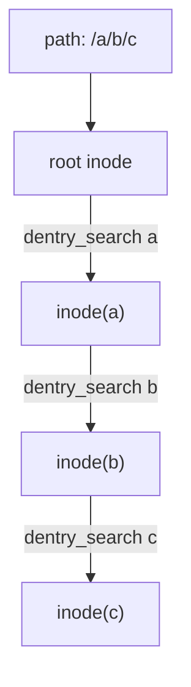
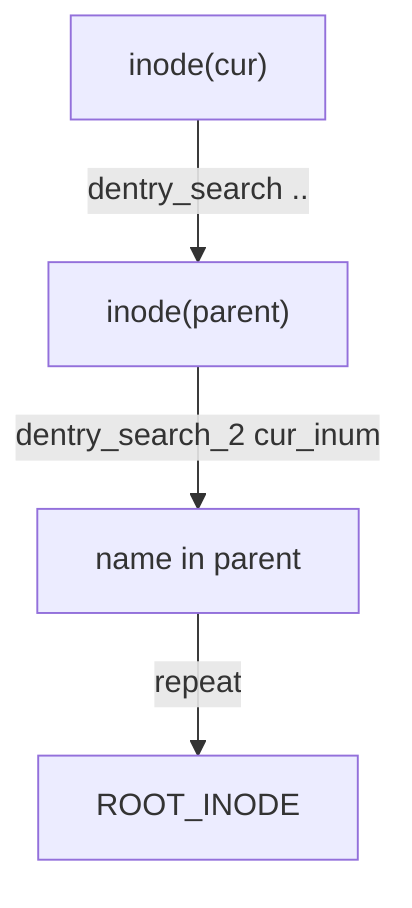
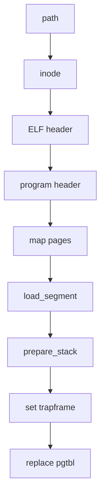
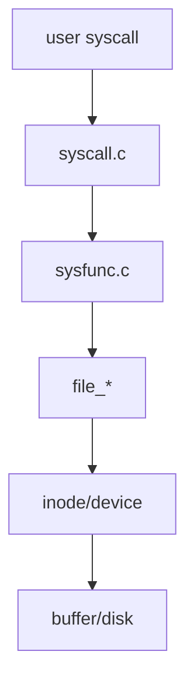

# LAB-9: 文件系统 之 文件管理与全系统整合

## 过程日志
1. 2025.12.25 更新lab-9文件
2. 2025.1.2 王俊翔完成lab-9实验，初步攥写报告
3. 2025.1.3 张子扬设计测试样例，优化实验报告

## 代码组织结构

```
ECNU-OSLAB-2025-TASK
├── LICENSE        开源协议
├── .vscode        配置了可视化调试环境
├── registers.xml  配置了可视化调试环境
├── .gdbinit.tmp-riscv xv6自带的调试配置
├── common.mk      Makefile中一些工具链的定义
├── Makefile       编译运行整个项目 (CHANGE)
├── picture        README使用的图片目录 (CHANGE)
├── README.md      实验指导书 (CHANGE)
└── src            源码
    ├── kernel     内核源码
    │   ├── arch   RISC-V相关
    │   │   ├── method.h
    │   │   ├── mod.h
    │   │   └── type.h
    │   ├── boot   机器启动
    │   │   ├── entry.S
    │   │   └── start.c
    │   ├── lock   锁机制
    │   │   ├── spinlock.c
    │   │   ├── sleeplock.c
    │   │   ├── method.h
    │   │   ├── mod.h
    │   │   └── type.h
    │   ├── lib    常用库
    │   │   ├── cpu.c
    │   │   ├── console.c (NEW, 行缓冲的输入输出)
    │   │   ├── print.c (CHANGE, 在print_init中调用console_init进行初始化)
    │   │   ├── uart.c (CHANGE, 将uart_intr中的switch-case逻辑换成cons_edit)
    │   │   ├── utils.c
    │   │   ├── method.h (CHANGE)
    │   │   ├── mod.h
    │   │   └── type.h (CHANGE)
    │   ├── mem    内存模块
    │   │   ├── pmem.c (DONE, 增加函数pmem_stat用于获取剩余页面数量信息)
    │   │   ├── kvm.c
    │   │   ├── uvm.c (DONE, 修改uvm_heap_grow以支持flag的输入)
    │   │   ├── mmap.c
    │   │   ├── method.h (CHANGE)
    │   │   ├── mod.h
    │   │   └── type.h
    │   ├── trap   陷阱模块
    │   │   ├── plic.c
    │   │   ├── timer.c
    │   │   ├── trap_kernel.c
    │   │   ├── trap_user.c
    │   │   ├── trap.S
    │   │   ├── trampoline.S
    │   │   ├── method.h
    │   │   ├── mod.h
    │   │   └── type.h
    │   ├── proc   进程模块
    │   │   ├── proc.c (DONE, 增加open_file和cwd的初始化、设置、销毁逻辑)
    │   │   ├── exec.c (DONE, 操作ELF文件以填充新的进程)
    │   │   ├── swtch.S
    │   │   ├── method.h (CHANGE)
    │   │   ├── mod.h
    │   │   └── type.h (CHANGE)
    │   ├── syscall 系统调用模块
    │   │   ├── syscall.c (DONE, 新的系统调用)
    │   │   ├── sysfunc.c (DONE, 新的系统调用)
    │   │   ├── method.h (DONE, 新的系统调用)
    │   │   ├── mod.h
    │   │   └── type.h (DONE, 新的系统调用)
    │   ├── fs     文件系统模块
    │   │   ├── bitmap.c
    │   │   ├── buffer.c
    │   │   ├── inode.c
    │   │   ├── device.c (DONE, 增加设备文件操作逻辑)
    │   │   ├── dentry.c (DONE, 增加目录和路径的功能)
    │   │   ├── fs.c (DONE, 增加文件操作逻辑)
    │   │   ├── virtio.c
    │   │   ├── method.h (CHANGE)
    │   │   ├── mod.h
    │   │   └── type.h (CHANGE)
    │   └── main.c
    ├── mkfs       磁盘映像初始化
    │   ├── mkfs.c (CHANGE, 增加输入参数的支持)
    │   └── mkfs.h (CHANGE)
    ├── loader     存放链接脚本
    │   ├── kernel.ld (CHANGE, 移动了位置)
    │   └── user.ld (NEW, 定义了用户态ELF程序的链接规则)
    └── user       用户程序
        ├── initcode.c (CHANGE, 启动测试程序)
        ├── syscall.c (NEW, 封装了系统调用)
        ├── help.c (NEW, 其他公共库函数)
        ├── test_1.c (NEW, 测试点)
        ├── test_2.c (NEW, 测试点)
        ├── test_3.c (NEW, 测试点)
        ├── test_4.c (NEW, 测试点)
        ├── help.h (NEW, 库函数和重要定义)
        ├── sys.h
        ├── syscall_arch.h
        └── syscall_num.h (CHANGE, 新的系统调用)
```

**标记说明**

**NEW**: 新增源文件, 直接拷贝即可, 无需修改  
**CHANGE**: 旧的源文件发生了更新, 直接拷贝即可, 无需修改  
**TODO**: 你需要实现新功能 / 你需要完善旧功能  

---

## 实验思路与代码讲解

本实验的目标是把“文件系统的静态结构”和“进程的动态行为”连成一条可运行的链路。阅读 `lab-9-README.md` 后，我把任务拆成两条主线：

1. **静态结构**：inode/dentry/file/device 的抽象要完整，路径解析要可正向/逆向，设备要落盘并可读写。  
2. **动态路径**：用户态系统调用 -> 内核服务函数 -> 文件抽象层 -> inode/设备层 -> buffer/磁盘。  

只要这两条线都通了，`exec` 能跑起来，`test_1~test_4` 就能连贯完成。

下面按阅读 README 时的理解顺序，解释具体实现逻辑与对应代码位置，并穿插简单流程图说明。

### 1) 基础能力：内存统计 + 用户堆权限

**问题**：设备文件中的 gpt0 需要读取内存统计；exec 时如果段权限不正确，用户态写入会崩溃。  

**实现**：
- `src/kernel/mem/pmem.c`  
  - `pmem_stat` 直接读取 `kern_region/user_region` 的 `allocable`。  
  - 统计读需要加锁，否则并发分配/释放会导致读值不一致。  
- `src/kernel/mem/uvm.c`  
  - `uvm_heap_grow` 增加 `flag` 参数，并合成 `perm = flag | PTE_U`。  
  - exec 加载 ELF 段时，用 `program_header.flags` 决定页面权限，否则 `.data/.bss` 写入会触发 `uvm_copyout` 报错。  

### 2) 目录项与路径解析：正向与逆向

**正向路径解析**：  
`/a/b/c` 按层级查找，每一层用 `dentry_search` 获取 inode 号，再 `inode_get` 进入下一层。  

**逆向路径解析**：  
从某个目录 inode 回到根目录，需要用 `..` 找父 inode，然后在父目录中反查当前 inode 的名字，最后倒序拼接路径字符串。  

正向路径流程图：


逆向路径流程图：


**实现**（`src/kernel/fs/dentry.c`）：
- `dentry_search_2`：根据 inode 号反查名字。  
- `dentry_transmit`：顺序输出有效目录项，供 `sys_get_dentries` 使用。  
- `inode_to_path`：用 `..` 找父目录，再在父目录中反查名字，倒序写入缓冲区。  
- `path_create_inode`：解析父目录与新名字，创建 inode 和 dentry，并在目录 inode 内写入 `.` 与 `..`。  
- `path_link/path_unlink`：维护硬链接计数；unlink 时禁止删除非空目录，避免形成孤儿子树。  
- `__path_to_inode`：当路径不以 `/` 开头时，从 `cwd` 起步，实现相对路径。  

### 3) 文件抽象：inode 与 file 的职责分离

inode 负责“共享的持久化信息”（类型、大小、数据块索引）；  
file 负责“进程私有的动态信息”（读写权限、偏移、引用）。  

**实现**（`src/kernel/fs/fs.c`）：
- `file_init/file_alloc`：维护全局 `file_table`，用 `lk_file_table` 做引用计数保护。  
- `file_open`：解析路径，必要时创建文件；打开设备文件要先检查读写权限合法性。  
- `file_read/file_write`：对 `DATA/DIR/DEVICE` 三类分别调用 `inode_read_data`、`dentry_transmit`、`device_*`。  
- `file_lseek`：普通文件限制偏移在 `[0, size]` 内；设备文件不强制限制。  
- `file_get_stat`：收集 inode 信息 + file 偏移，返回用户态 `file_stat_t`。  

### 4) 设备文件：统一抽象进文件系统

设备文件的核心就是“主设备号 -> 读写回调”。  

**实现**（`src/kernel/fs/device.c`）：
- `device_init` 注册 `/dev/stdin/stdout/stderr/zero/null/gpt0`，并确保在磁盘中创建对应 inode。  
- `device_open_check` 根据 `open_mode` 判断该设备是否允许读写。  
- `device_read_data/device_write_data` 按主设备号分派。  

这样用户态对设备文件的 `read/write` 就能走同一条文件接口链路。

### 5) 进程与文件系统协作：open_file + cwd

**需求**：进程必须保存“打开的文件表”和“当前工作目录”，否则相对路径不可用。  

**实现**（`src/kernel/proc/proc.c`）：
- `proc_init` 初始化 `open_file[]` 与 `cwd`，避免野指针。  
- `proc_return` 对 proczero 初始化标准 fd（stdin/stdout/stderr），并把 cwd 指向根目录。  
- `proc_fork` 复制 `open_file` 与 `cwd`（`file_dup` + `inode_dup`）。  
- `proc_free` 逐个关闭文件并释放 cwd。  

### 6) exec：加载 ELF 并替换进程地址空间

**流程**（`src/kernel/proc/exec.c`）：
1. 创建新页表，避免破坏旧页表。  
2. 解析路径得到 ELF inode，读取 ELF header。  
3. 遍历 program header，按 `ELF_PROG_FLAG` 组合权限并调用 `uvm_heap_grow` 扩展地址空间。  
4. 调用 `load_segment` 将段内容读入内存。  
5. `prepare_stack` 将 argv 按 ABI 对齐压栈，得到 `argc/argv/sp`。  
6. 释放旧地址空间，替换进程字段（页表、heap_top、ustack_npage、mmap）。  
7. 设置 trapframe：`a0=argc`、`a1=argv`、`epc=entry`、`sp=stack`。  

exec 关键流程图：


### 7) 系统调用：用户态入口到内核服务

**实现**：
- `src/kernel/syscall/syscall.c` 补全 9~22 的跳转表。  
- `src/kernel/syscall/sysfunc.c`  
  - `sys_exec` 将用户 argv 拷贝到内核缓冲再调用 `proc_exec`。  
  - `sys_open/close/read/write/lseek/dup/fstat/get_dentries` 对接 file 层。  
  - `sys_mkdir/chdir/print_cwd/link/unlink` 对接路径与 inode 逻辑。  

至此，用户态与内核的文件系统路径贯通。

系统调用到文件系统的调用链：


---  

## 测试分析

### 测试1
  
验证 stdin/stdout/stderr 与 exec 参数传递。  
关键现象：
- 打印 4 个参数，说明 `sys_exec` 的 argv 拷贝与 `prepare_stack` 的布局正确。  
- 输入一行后 stdout 与 stderr 都输出相同内容，说明 `/dev/stdin` 读与 `/dev/stdout`、`/dev/stderr` 写链路正确。  
结论：基本系统调用、设备文件与行缓冲 console 正常工作。

### 测试2
  
验证普通文件与目录的 open/close/dup/fstat，以及 read/write/lseek/get_dentries。  
关键现象：
- `ABC.txt` 多次写入后 size 增长，`fstat` 输出与预期一致，说明 `inode_write_data` 与 size 更新正确。  
- `lseek` 后的 `read` 能读到正确位置内容，说明 file 层 offset 逻辑正确。  
- root 目录能列出多个文件，说明 `dentry_transmit` 与目录读取逻辑正常。  
结论：普通文件读写、偏移移动与目录项遍历均可用。

### 测试3
  
验证 mkdir/chdir/print_cwd 以及 link/unlink。  
关键现象：
- 多级 `mkdir` 与相对路径 `chdir` 后 `print_cwd` 输出正确，说明 cwd 与相对路径解析正确。  
- `link` 后用不同路径打开同一文件，读到相同内容，`nlink` 正确，说明硬链接逻辑成立。  
- `unlink` 删除目录时，只有空目录能被删除，非空目录被阻止，说明目录保护逻辑正确。  
结论：相对路径、目录管理、硬链接与删除策略全部工作。

### 测试4
  
验证 /dev 目录与设备文件读写。  
关键现象：
- `/dev` 目录能列出 `stdin/stdout/stderr/zero/null/gpt0`，说明设备 inode 初始化正确。  
- `/dev/zero` 读取为全 0，`/dev/null` 写入成功但读取为 0 字节，符合设备语义。  
- `gpt0` 对固定问题返回固定回答，说明设备写回调分发正确。  
- A3 的剩余页数是动态值，受缓存与分配时机影响；报告中以截图数值为准。  
结论：设备文件读写通路完整，设备抽象正确落入文件系统体系。

### 测试5
  
验证硬链接生命周期与 nlink 变化。  
关键现象：
- 基文件写入后创建两个硬链接，`fstat` 观察到 `nlink` 从 1 依次升至 3。  
- 通过两个不同路径读取数据一致，说明多路径共享同一 inode 数据。  
- 依次 `unlink` 链接与基文件，`nlink` 递减至 1 后再删除最后一个链接，文件不可再打开。  
结论：硬链接计数维护、相对路径解析以及删除后的资源释放逻辑正确。

---  

## 实验反思

本次实验的关键在于把“静态结构”与“动态路径”对齐：  
静态结构包括 inode、dentry、device 的正确组织；动态路径则是系统调用到文件操作的完整闭环。  
实践中最容易出错的是“权限与生命周期”，例如 exec 段权限不匹配导致用户态写入失败，或 cwd/open_file 管理不完整导致路径解析错误。  
通过逐层打通并按测试用例回归验证，最终保证了文件系统与进程系统的整合效果。
