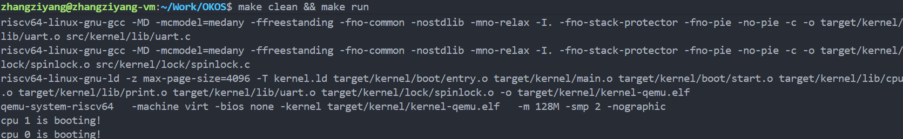

# OK Kernel
## lab1
对于**子任务一：进图main函数**，理解程序从entry.S->start.c->main.c的启动结构
- entry.S负责汇编层面的双核启动和栈设置
- start.c完成早期硬件初始化
- main.c作为系统主入口点

对于**子任务2：通过printf输出信息**，基于uart_putc_sync()实现字符输出并解析格式化字符串，支持基本的数据类型转换（%d, %s, %x等），同时使用自旋锁，实现对于串口作为共享资源，多核同时调用printf会导致输出混乱的问题

最后的实验结果截图如下：

对于

