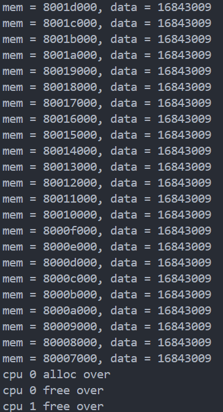
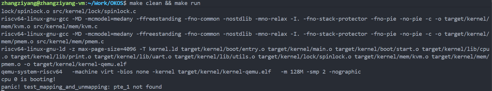
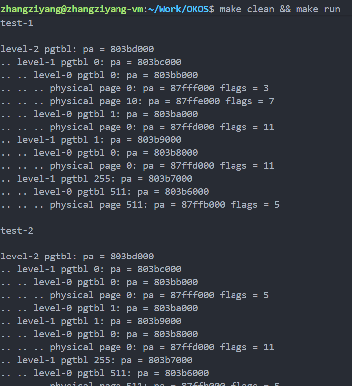
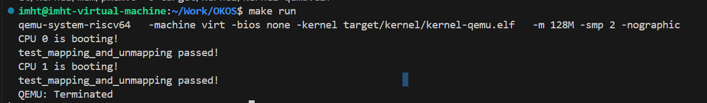

# lab2：内存管理初步
## 过程日志
1. 2025.9.29 更新lab2文件
2. 2025.9.29 张子扬完成修改pmem.c，完成lab2第一阶段
3. 2025.10.13 王俊翔完成lab2第二阶段
4. 2025.10.27 张子扬增加一个测试样例

## 代码结构
```
OKOS
├── LICENSE        开源协议
├── .vscode        配置了可视化调试环境
├── registers.xml  配置了可视化调试环境
├── common.mk      Makefile中一些工具链的定义
├── Makefile       编译运行整个项目 (CHANGE, 增加trap和mem目录作为target)
├── kernel.ld      定义了内核程序在链接时的布局 (CHANGE, 增加一些关键位置的标记)
├── pictures       README使用的图片目录
├── lab2实验文档.md 实验指导书
├── README.md      实验报告 
└── src            源码
    └── kernel     内核源码
        ├── arch   RISC-V相关
        │   ├── method.h
        │   ├── mod.h
        │   └── type.h
        ├── boot   机器启动
        │   ├── entry.S
        │   └── start.c
        ├── lock   锁机制
        │   ├── spinlock.c
        │   ├── method.h
        │   ├── mod.h
        │   └── type.h
        ├── lib    常用库
        │   ├── cpu.c
        │   ├── print.c
        │   ├── uart.c
        │   ├── utils.c (NEW, 工具函数)
        │   ├── method.h (CHANGE, utils.c的函数声明)
        │   ├── mod.h
        │   └── type.h
        ├── mem    内存模块
        │   ├── pmem.c (DONE, 物理内存管理)
        │   ├── kvm.c (DONE, 内核态虚拟内存管理)
        │   ├── method.h (NEW)
        │   ├── mod.h (NEW)
        │   └── type.h (NEW)
        ├── trap   陷阱模块
        │   ├── method.h (NEW)
        │   ├── mod.h (NEW)
        │   └── type.h (NEW, 增加CLINT和PLIC寄存器定义)
        └── main.c (DONE)
```

## 实验分析
该实验的主题是内存管理初步，目标是为了实现物理内存管理和内核态虚拟内存管理。
### 第一阶段: 物理内存
该阶段是为了管理由 ALLOC_BEGIN ~ ALLOC_END 区域的物理页的相关内容，该内存布局由 kernel.ld 定义，其示意图如下：
```
物理地址空间划分：
┌────────────────────────────────────┐
│ 0x80000000 ~ KERNEL_DATA           │ ← 内核代码段（不可分配）
├────────────────────────────────────┤
│ KERNEL_DATA ~ ALLOC_BEGIN          │ ← 内核数据段（不可分配）
├────────────────────────────────────┤
│ ALLOC_BEGIN ~ (ALLOC_BEGIN+4MB)    │ ← 内核物理页池（1024页）
├────────────────────────────────────┤
│ (ALLOC_BEGIN+4MB) ~ ALLOC_END      │ ← 用户物理页池（剩余页）
└────────────────────────────────────┘
```

完成 pmem.c 的修改实现以下函数：
```c
void pmem_init();    // 初始化系统, 只调用一次
void* pmem_alloc();  // 申请一个空闲的物理页
void pmem_free();    // 释放一个之前申请的物理页
```
#### test1
完成 test1 这个测试用例，它的作用是：
向cpu-0和cpu-1并行申请全部1024个内核页, 赋值并输出信息，待申请全部结束， 并行释放所有申请的物理内存，从而验证自旋锁保护的正确性，验证内存清零和数据写入。实验结果的截图如下：



#### test2
test2测试用例的作用是：
1. 测试内存耗尽的`panic`是否正常触发
2. 测试用户空间物理页申请和释放的正确性

实验结果的截图如下：


### 第二阶段: 内核态虚拟内存
修改 kvm.c ，实现页表项(PTE) 和 页表(pgtbl)。
#### test1
test1测试用例测试了两件事情:
1. 使用内核页表后你的OS内核是否还能正常执行
2. 使用映射和解映射操作修改你的页表, 使用vm_print输出它被修改前后的对比

实验结果截图如下：


#### test2
这个测试用例主要关注映射和解映射是否正确执行，得到的实验结果截图如下：


### 补充测试样例
`test_vm_multilevel_and_partial_unmap` 这个测试用例主要验证以下两个核心功能：
1.  **多级页表创建**: 测试 `vm_mappages` 是否能够正确地创建缺失的中间级别页表。它会尝试在一个与之前映射地址相距甚远的虚拟地址上创建映射，这会强制 `vm_getpte` 函数分配新的二级甚至一级页表来完成地址翻译路径。
2.  **部分解映射**: 测试 `vm_unmappages` 的精确性。它会先建立一个跨越多个页的连续映射区域，然后只解映射这个区域中间的一部分，最后通过 `vm_getpte` 检查，确保只有被指定的部分被解除了映射，而区域的头部和尾部映射依然有效。

**测试代码**
```c
void test_vm_multilevel_and_partial_unmap()
{
    printf("starting test_vm_multilevel_and_partial_unmap...\n");
    pgtbl_t pgtbl = (pgtbl_t)pmem_alloc(true);
    memset(pgtbl, 0, PGSIZE);

    // Test 1: 验证部分解映射 (Partial Unmap)
    // 映射一个包含3个页的连续虚拟地址区域
    uint64 va_start = 0x200000; // 2MB
    uint64 pa_start = (uint64)pmem_alloc(false);
    vm_mappages(pgtbl, va_start, pa_start, 3 * PGSIZE, PTE_R | PTE_W);

    // 验证映射是否成功
    assert(PTE_TO_PA(*vm_getpte(pgtbl, va_start, false)) == pa_start, "partial unmap: head mapping failed");
    assert(PTE_TO_PA(*vm_getpte(pgtbl, va_start + PGSIZE, false)) == pa_start + PGSIZE, "partial unmap: middle mapping failed");
    assert(PTE_TO_PA(*vm_getpte(pgtbl, va_start + 2 * PGSIZE, false)) == pa_start + 2 * PGSIZE, "partial unmap: tail mapping failed");

    // 只解映射中间的页
    vm_unmappages(pgtbl, va_start + PGSIZE, PGSIZE, false); // free_pa=false

    // 检查：头部和尾部映射应仍然存在，中间的应被移除
    pte_t *pte_head = vm_getpte(pgtbl, va_start, false);
    pte_t *pte_mid = vm_getpte(pgtbl, va_start + PGSIZE, false);
    pte_t *pte_tail = vm_getpte(pgtbl, va_start + 2 * PGSIZE, false);

    assert(pte_head && (*pte_head & PTE_V), "partial unmap: head should remain mapped");
    assert(!pte_mid || !(*pte_mid & PTE_V), "partial unmap: middle should be unmapped");
    assert(pte_tail && (*pte_tail & PTE_V), "partial unmap: tail should remain mapped");
    printf("test 1 (partial unmap) passed.\n");

    // Test 2: 验证跨页目录的映射 (Multi-level Page Table Creation)
    // 选择一个与之前地址相距很远的VA，强制创建新的L1/L2页表
    uint64 va_far = 0x100000000; // 4GB, 肯定需要新的L1页表项
    uint64 pa_far = (uint64)pmem_alloc(false);
    vm_mappages(pgtbl, va_far, pa_far, PGSIZE, PTE_R);

    // 验证映射是否成功
    pte_t *pte_far = vm_getpte(pgtbl, va_far, false);
    assert(pte_far && (*pte_far & PTE_V), "multi-level: far va mapping failed");
    assert(PTE_TO_PA(*pte_far) == pa_far, "multi-level: pa mismatch for far va");
    printf("test 2 (multi-level) passed.\n");

    // 清理
    pmem_free((void*)pa_start);
    pmem_free((void*)pa_far);
    // 假设有一个函数可以销毁整个页表以释放所有页表页
    // vm_destroy(pgtbl); 
    pmem_free(pgtbl);

    printf("test_vm_multilevel_and_partial_unmap passed!\n");
}
```

**实验结果**

通过实验测试


## 实验感想
1. 与 CSAPP 的内容有所呼应，CSAPP 中介绍的页表结构、地址翻译机制、内存分配策略等概念在此次实验中得到了具体实现。特别是对虚拟内存"为每个进程提供独立地址空间假象"这一核心思想的理解更加深刻，从理论层面的页表遍历算法到实际的RISC-V SV39规范实现，真正体验了从抽象概念到硬件实现的完整过程，从理论到实践。
