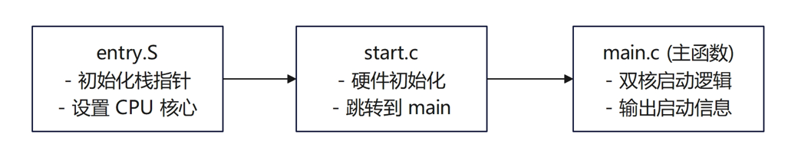
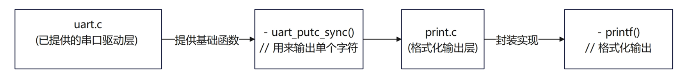
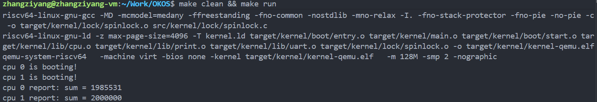
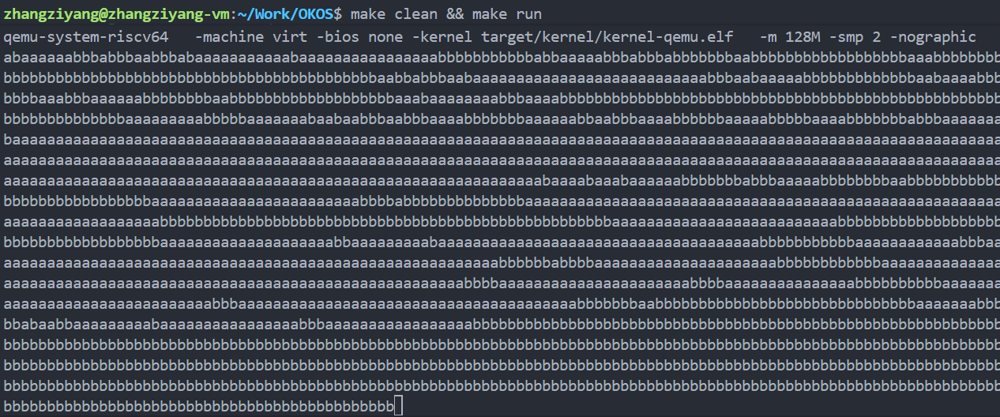

# lab1:机器启动
## 过程日志
1. 2025.9.22 更新 lab1 的实验文件
2. 2025.9.22 张子扬完成子任务1：进入 main 函数
3. 2025.9.23 张子扬完成完成部分子任务2：通过 printf 输出信息，但 spinlock 功能存在问题
4. 2025.9.27 王俊翔完成 spinlock 功能的实现

## 实验分析
这个实验的目标是为了完成双核的机器启动, 进入main函数并输出启动信息，其涉及的主要文件与关键的启动流程如下所示:
```
entry.S → start.c → main.c → 输出字符串
   ↓         ↓         ↓
 汇编启动   C语言初始化  主函数
```
因此可将实验拆分成两个阶段，即进入 main 函数与通过 printf 输出信息：

对于**子任务一：进入main函数**，其目标就是让内核在 QEMU 上跑起来，其实现逻辑如下：


对于**子任务2：通过printf输出信息**，其实现逻辑如下：


但是，多核同时调用 printf 会导致输出混乱的问题，这是因为 UART 串口资源没有受到保护，多核同时调用会相互打断，这个在课后作业中有更具体的事例。
```
打断示意：
// 假设CPU 0 执行
printf("aaaaaaaaaa");  // 实际是 10 次 uart_putc_sync()
// 假设CPU 1 同时执行  
printf("bbbbbbbbbb");  // 也是 10 次 uart_putc_sync()

时间轴 →
CPU 0: a → a → [被打断] → a → a ...
CPU 1:     [插入] → b → b → b → [被打断] → b ...

UART输出: a a b b b a a b a b b ...  ❌ 混乱！
```

所以要使用自旋锁，独占串口，一次性输出完整字符串。

最后的实验结果截图如下：


## 课后作业
### 并行加法问题
这个问题是由于两个CPU核心在没有同步机制的情况下同时对共享变量 sum 进行写操作，导致了数据竞争（Race Condition）。
两个CPU核心交替获取锁执行 sum++ 操作，CPU 0 先完成自己的100万次加法循环，但由于CPU 1 同时也在执行加法，当CPU 0 打印报告时： CPU 1 可能还在执行部分加法操作，CPU 0 看到的sum值可能不是最终的200万，CPU 1 完成后打印报告，此时所有加法操作完成，sum达到200万。为了解决这个问题，引入锁机制来保护临界区（Critical Section），也就是 sum++ 这个操作。当一个CPU核心进入临界区时，它会先获取锁，此时其他核心如果也想进入临界区，就必须等待，直到该核心释放锁。
修改后的代码如下：
```c
volatile static int started = 0;

volatile static int sum = 0;
// 定义一个锁来保护sum
static spinlock_t sum_lock;

int main()
{
    int cpuid = r_tp();
    if(cpuid == 0) {
        print_init();
        // 初始化锁
        spinlock_init(&sum_lock, "sum_lock");
        printf("cpu %d is booting!\n", cpuid);        
        __sync_synchronize();
        started = 1;
        for(int i = 0; i < 1000000; i++){
            // 在修改sum前获取锁
            spinlock_acquire(&sum_lock);
            sum++;
            // 修改sum后释放锁
            spinlock_release(&sum_lock);
        }
        printf("cpu %d report: sum = %d\n", cpuid, sum);
    } else {
        while(started == 0);
        __sync_synchronize();
        printf("cpu %d is booting!\n", cpuid);
        for(int i = 0; i < 1000000; i++){
            // 在修改sum前获取锁
            spinlock_acquire(&sum_lock);
            sum++;
            // 修改sum后释放锁
            spinlock_release(&sum_lock);
        }
        printf("cpu %d report: sum = %d\n", cpuid, sum);
    }   
    while (1);    
}  
```
实验结果如下：


由此引发了我们对于锁的粒度大小的思考，也就是说，锁的不同粒度会对函数结果与使用有很大的影响：

**锁的粒度过细**：如果像现在这样，在 for 循环内部，每次 sum++ 操作都进行加锁和解锁（acquire -> sum++ -> release）。
优点：能确保 sum 的值正确累加，因为保护了最小的临界区。
缺点：加锁和解锁本身是有开销的。在循环中频繁地获取和释放锁会导致大量的性能损耗，降低了并行计算的效率。两个 CPU 大部分时间可能都在等待对方释放锁。

**锁的粒度过粗**：如果将整个 for 循环作为临界区，在循环开始前加锁，循环结束后解锁（acquire -> for 循环 -> release）。
优点：减少了加锁和解锁的次数，开销较小。
缺点：一个 CPU 会持有锁并执行完整个百万次的循环，而另一个 CPU 在此期间会一直自旋等待。这完全失去了并行计算的意义，程序退化成了串行执行，总耗时会更长。

### 并行输出问题
这个作业是为了更直观的体现，在无锁的情况下的并行输出的错误情况，设计的实验样例如下：

```c
int main()
{
    int cpuid = r_tp();
    if(cpuid == 0) {
        print_init();
        // 初始化锁
        // spinlock_init(&sum_lock, "sum_lock");
        // printf("cpu %d is booting!\n", cpuid);        
        __sync_synchronize();
        started = 1;
        for(int i = 0; i < 100; i++){
            printf("aaaaaaaaaa");
        }
    } else {
        while(started == 0);
        __sync_synchronize();
        for(int i = 0; i < 100; i++){
            printf("bbbbbbbbbb");
        }
    }   
    while (1);    
}  
```
实验结果如下图：



图中可以看到 'a' 和 'b' 混乱交替输出的情景。

## 实验反思
### 并发不等于并行的高效
- 细粒度锁：200万次加锁/解锁 → 正确但慢
- 粗粒度锁：2次加锁/解锁 → 退化成串行
- 无锁：快但错误

并发编程的本质是在正确性和性能之间寻找平衡，最快的代码往往不是最正确的代码，"并行"不一定比"串行"快，关键看锁的开销

### 资源抽象与保护的统一性
实验涉及两种资源：

| 资源类型     | 具体对象    | 保护手段 |
| :------- | :------ | :--- |
| **硬件资源** | UART 串口 | 自旋锁  |
| **内存资源** | 变量 sum  | 自旋锁  |

- 无论是物理设备还是内存变量，只要是"共享"的，都需要保护
- 操作系统的核心工作之一：管理资源的互斥访问
- 自旋锁是最基础的同步原语，后续的信号量、条件变量等都建立在此之上