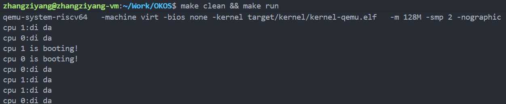
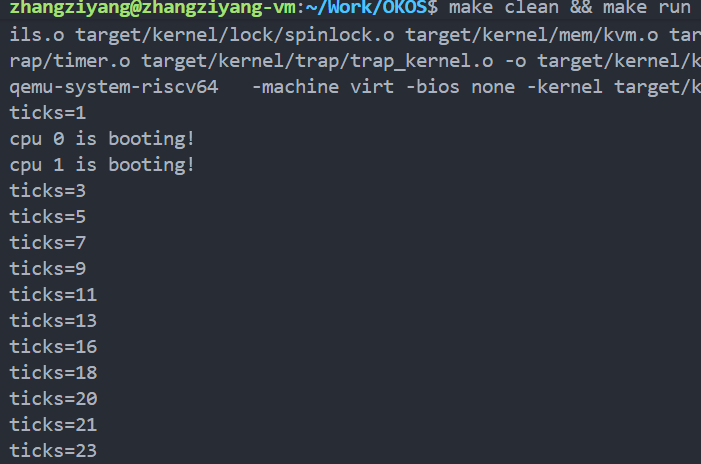
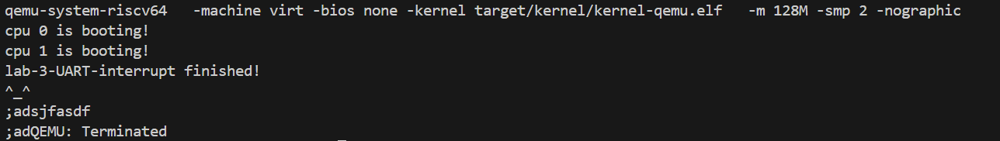

# LAB-3 中断异常初步

## 过程日志
1. 2025.10.13 更新lab3文件
2. 2025.10.14 王俊翔完成实验要求 1&2
3. 2025.10.16 张子扬完成实验要求 3&4
4. 2025.10.26 王俊翔完善 readme，增加图解

## 实现思路  
  
- 抽象目标：构建“被打断 → 处理中断 → 返回”这条闭环，实现为OS内核引入初级的“中断+异常”的识别和处理能力。
- 实践落点：
  1. `start.c` 在 M-mode 设置委托、激活计时器；
  2. `main.c` + `trap_kernel_init` 准备页表与 PLIC；
  3. `trap.S` 保存/恢复寄存器；
  4. `trap_kernel.c` 根据 `scause` 分发；
  5. `plic.c` / `timer.c` / `uart.c` 处理硬件细节；
  6. 通过滴答日志、串口回显验证链路是否正常。


## 串口中断旅程（UART）
```
┌────────────┐        ┌─────────────┐        ┌──────────────┐
│  UART RX   │ ─────► │  PLIC IRQ   │ ─────► │ kernel_vector│
│ (字符到达)  │        │  聚合仲裁   │        │ 保存32个寄存器 │
└────────────┘        └──────┬──────┘        └──────────────┘
                              │
                              ▼
                       ┌──────────────┐
                       │trap_kernel   │ 读取 scause，高位=1? 低位=9?
                       │_handler      │─────┬───────────────┐
                       └──────┬───────┘     │ yes           │ no → panic
                              │             ▼
                              │      ┌──────────────────────────┐
                              │      │external_interrupt_handler│
                              │      └──────┬───────────────────┘
                              │             │
                              │       plic_claim()
                              │             │← IRQ==UART?
                              │             ▼
                              │      ┌─────────────┐
                              │      │ uart_intr() │ 处理CR/LF、退格、打印字符
                              │      └──────┬──────┘
                              │             │
                              │       plic_complete()
                              ▼
                    ┌─────────────────┐
                    │ kernel_vector   │ 恢复寄存器
                    └─────────────────┘
                              │
                              ▼
                           sret → 回到被中断的指令
```

### 关键步骤

- **M 态委托与准备（start.c）**  
- **S 态入口与开关（main.c, `trap_kernel_inithart`, `trap_kernel_init`）**  
每个 hart 在 `trap_kernel_inithart()` 里做三件事：`w_stvec(kernel_vector)` 装好 S 态 trap 入口、`w_sie(...)` 打开外部/软件/时钟三类中断开关、`intr_on()` 打开总开关。这样外设中断一到就会跳进 `kernel_vector`。
- **Trap 入口保存（trap.S）**  
`kernel_vector` 保存 32 个寄存器再调用 `trap_kernel_handler`：保证 C 代码能自由使用寄存器；没有这个“保存→处理→恢复”，回到原指令时寄存器会被破坏。
- **返回 C 语言（trap_kernel.c）**  
`kernel_vector` 在 trap.S 里面，按 RISC-V 约定先把 32 个寄存器都推到栈上，确保后面的 C 代码不污染现场，然后调用 `trap_kernel_handler()`。这个函数读取 `scause`，判断高位是 1 就说明是中断，再看低 4 位是否为 9——这是 S 态外部中断。匹配后进入在 `external_interrupt_handler()` 中调用 `plic_claim()` 询问 PLIC 哪个 IRQ 触发的。如果等于 `UART_IRQ`，就调用 `uart_intr()`。
- **设备逻辑（`uart_intr()`）**  
这个函数从 UART FIFO 里不断读字符，把 `\r`/`\n` 统一回显为 `\r\n`，对退格（`\b`/`0x7f`）输出 `"\b \b"` 完成视觉删除，其余只回显可打印字符。处理完后，一定要 `plic_complete(irq)` 归还，否则 PLIC 会认为我还没处理完，不会再发新中断。最后 `kernel_vector` 恢复寄存器，执行 `sret` 回到被打断的指令。


## 时钟中断旅程（CLINT）
```
┌────────────┐        ┌─────────────┐
│  CLINT     │        │ timer_init  │ 在 start.c:
│ (mtime到点)│◄──────►│ 设置mtvec    │  mtimecmp = mtime + INTERVAL
└────┬───────┘        │ mie |= MTIE │  mscratch 指向缓冲区
     │                └─────────────┘
     │ 触发 M 态时钟中断
     ▼
┌──────────────┐
│ timer_vector │ 保存 a1-a3，交换 mscratch
│ (M 态入口)   │ 更新 mtimecmp += INTERVAL
└────┬────────┘
     │
     ▼
csrs sip, SSIP        ──────► 触发 S 态软件中断
mret 返回 M 态上下文
     │
     ▼
┌──────────────┐
│ kernel_vector│ 保存32个寄存器
└────┬─────────┘
     │
     ▼
┌──────────────┐
│trap_kernel   │ 读取 scause：高位=1? 低位=1?
│_handler      │─────┬───────────────┐
└────┬─────────┘     │ yes           │ no → panic
     │              ▼
     │      ┌────────────────────────┐
     │      │timer_interrupt_handler │
     │      └──────┬─────────────────┘
     │             │
     │        mycpuid()==0?
     │             │ yes
     │             ▼
     │      ┌──────────────┐
     │      │timer_update()│ ticks++（自旋锁保护）
     │      └──────────────┘
     │
     └─ w_sip(r_sip() & ~SSIP) 清除软件中断标志
            ▼
┌─────────────────┐
│ kernel_vector   │ 恢复寄存器
└─────────────────┘
            │
            ▼
         sret → 回到被中断的指令
```

### 关键步骤

- **M 态定时器配置（`start.c::timer_init`）**  
在 `start()` 里调用 `timer_init()`，做三件事：把 `mtimecmp` 设成 `mtime + INTERVAL`；把当前 hart 的 `mscratch` 指向一块暂存区，存放 `mtimecmp` 地址和 `INTERVAL`；把 `mtvec` 设置成 `timer_vector` 并打开放在 `mie` 里的 MTIE 位。当 `mtime == mtimecmp` 时，硬件先跳到 `timer_vector`（还在 M 态）。
- **S 态入口与开关（同串口）**  
- **M 态中转（`timer_vector`）**  
这里交换`mscratch` 与 `a0`，保存 `a1`~`a3`，再把 `mtimecmp` 加上 `INTERVAL`，相当于立刻预约下一次响铃。然后使用 `csrs sip, 2` 设置 S 态软件中断位，表示“有时钟事件需要内核处理”，最后恢复寄存器、`mret` 返回原来的 M 态上下文。因为软件中断位被置 1，接下来就会进入 S 态的 `kernel_vector`
- **返回 C 语言（`trap_kernel_handler` → `timer_interrupt_handler`）**  
S 态 `trap_kernel_handler()` 读取到 `scause` 高位=1 且低位=1，就进入 `timer_interrupt_handler()`。为了避免多核竞争，让 `mycpuid()==0` 的核执行 `timer_update()`，在自旋锁保护下递增 `sys_timer.ticks`，可用来驱动调度或打印节拍。处理完后，用 `w_sip(r_sip() & ~2)` 清掉软件中断位，否则会立即再次掉进中断。最后 `kernel_vector` 复原寄存器并 `sret` 返回。
- **定时逻辑（`timer_update` 等）**  
  - `spinlock_acquire`/`release` 保护 `ticks`，防止并发写；`ticks++` 就是抽象里的“系统时钟加一”。后续可以在这里加调度、打印等行为。


### 小总结
这两条链路的核心思想一样：先在 M 态（或 PLIC）把硬件信号转交给内核，再用统一的 `kernel_vector` 保存现场，进入 C 层根据 `scause` 分发到具体驱动，处理完后归还/清除，再恢复寄存器返回。串口是外设 IRQ，通过 PLIC 识别；时钟是 CLINT 触发，通过 M 态 `timer_vector` 转成 S 态软件中断。

---

## 测试样例
### 嘀嗒测试
在 `trap_kernel.c` 中的 `timer_interrupt_handle` 修改如下：
```c
// 时钟中断处理 (基于CLINT)
void timer_interrupt_handler(void) {
    // 清除 SSIP，避免反复进入
    w_sip(r_sip() & ~2);

    // 在合适的位置添加一行“滴答”输出
    printf("cpu %d:di da\n", mycpuid());
}
```



并且，注意到，“di da”来自定时器触发的 S 态软件中断，其出现时间取决于两件事：每核何时开中断、各核 mtimecmp 何时到期。两核之间没有先后保证，所以可能先看到“cpu 1:di da”，再看到“cpu 0:di da”，所以与题干中的结果又一定出入。

### 时钟快慢测试
在 `trap_kernel.c` 中的 `timer_interrupt_handle` 修改如下：
```c
void timer_interrupt_handler(void) {
    // 清除 SSIP，避免反复进入
    w_sip(r_sip() & ~2);

    // 递增全局ticks（原子加），仅CPU0打印
    uint64 t = __sync_add_and_fetch(&g_ticks, 1);
    if (mycpuid() == 0) {
        printf("ticks=%d\n", (int)t);
    }
}
```
修改INTERVAL, 观察ticks输出速度, 肉眼可见的观察到了快慢变化


### UART输入测试
  
实现了输入字符并回显到屏幕上(包括Backspace和换行)

## 实验感想
1. 真切体会到“入口要干净”：trap.S 先把32个寄存器完整压栈，不然 C 里随手用寄存器就会把现场污染；返回前对齐地恢复，sret 才能稳回原指令。
2. 定时器这条链路很妙：M 态的 timer_vector 只做“续约 mtimecmp + csrs sip, SSIP”，真正工作在 S 态完成；而且 PLIC 一定要 claim/complete，否则后续中断直接饿死。