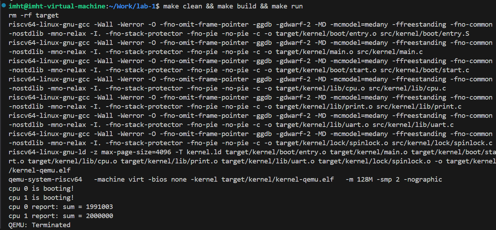

## `lab-1` 任务文档

### 课后任务 `4.1`  
---
#### **代码主要更改部分**
- 增加自旋锁头文件，静态自旋锁的变量声明
- 在`CPU 0`初始化锁
- 每个`sum++`前后都加锁、解锁`spinlock_acquire(&sum_lock)`和`spinlock_release(&sum_lock)`   
 
#### **选择细粒度锁的原因**
1. **粗粒度锁**（保护整个循环）：
    ```c
    spinlock_acquire(&sum_lock);
    for(int i = 0; i < 1000000; i++)
        sum++;
    spinlock_release(&sum_lock);
    ```

    **输出结果**：
      


    **原因分析**：  
    - `CPU 0` 先获取锁，执行完整个100万次加法循环，sum达到100万
    - `CPU 0` 释放锁后打印报告，显示 `sum = 1000000`
    - `CPU 1` 然后获取锁，执行自己的100万次加法，sum从100万增加到200万
    - `CPU 1` 打印报告时，sum已经达到200万
    锁的粒度粗：整个循环被原子化执行，CPU执行顺序是串行的

2. **细粒度锁**（只保护关键操作）：
    ```c
    for(int i = 0; i < 1000000; i++) {
        spinlock_acquire(&sum_lock);
        sum++;
        spinlock_release(&sum_lock);
    }
    ```

    **输出结果**:  
      

    **原因分析**：
    - 两个CPU核心交替获取锁执行 `sum++` 操作
    - `CPU 0` 先完成自己的100万次加法循环，但由于`CPU 1`同时也在执行加法，当`CPU 0`打印报告时：
        - `CPU 1` 可能还在执行部分加法操作
        - `CPU 0` 看到的sum值可能不是最终的200万
    - `CPU 1` 完成后打印报告，此时所有加法操作完成，sum达到200万  


对于 `sum++` 操作，**细粒度锁是最佳选择**：
- 最小化锁持有时间
- 最大化CPU利用率
- 虽然锁操作频繁，但现代CPU的原子操作效率很高

#### **完整任务代码**  
```c
#include "arch/mod.h"
#include "lib/mod.h"
#include "lock/mod.h"

volatile static int started = 0;
volatile static int sum = 0;
static spinlock_t sum_lock;

int main()
{
    int cpuid = r_tp();
    
    if(cpuid == 0) {
        // 初始化打印系统
        print_init();
        // 初始化自旋锁
        spinlock_init(&sum_lock, "sum_lock");
        printf("cpu %d is booting!\n", cpuid);
        __sync_synchronize();
        started = 1;
        for(int i = 0; i < 1000000; i++) {
            spinlock_acquire(&sum_lock); // 加锁
            sum++;
            spinlock_release(&sum_lock); // 解锁
        }
        printf("cpu %d report: sum = %d\n", cpuid, sum);
    } else {
        while(started == 0);
        __sync_synchronize();
        printf("cpu %d is booting!\n", cpuid);
        for(int i = 0; i < 1000000; i++) {
            spinlock_acquire(&sum_lock); // 加锁
            sum++;
            spinlock_release(&sum_lock); // 解锁
        }
        printf("cpu %d report: sum = %d\n", cpuid, sum);
    }
    
    // 无限循环，保持系统运行
    while (1) {
        // 可以在这里添加其他功能
    }
    
    return 0;
}
```