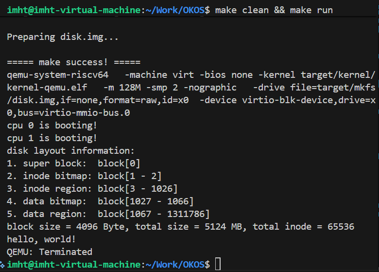
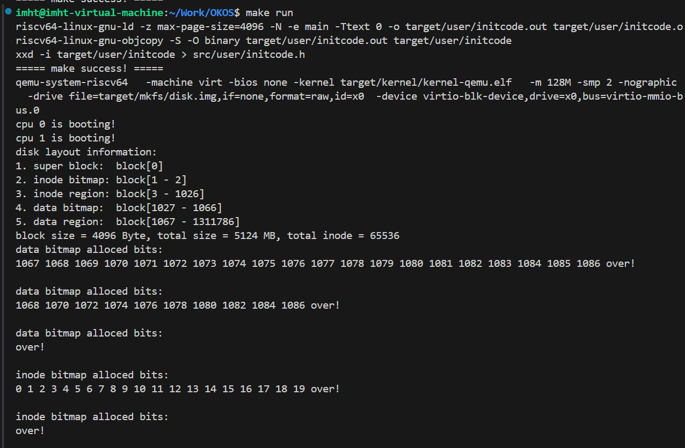

# LAB-7: 文件系统 之 磁盘管理

## 过程日志
1. 2025.11.27 更新lab7文件
2. 2025.11.28 王俊翔完成三个test

## 代码结构
```
OKOS
├── LICENSE        开源协议
├── .vscode        配置了可视化调试环境
├── registers.xml  配置了可视化调试环境
├── .gdbinit.tmp-riscv xv6自带的调试配置
├── common.mk      Makefile中一些工具链的定义
├── Makefile       编译运行整个项目 (CHANGE)
├── kernel.ld      定义了内核程序在链接时的布局
├── pictures       README使用的图片目录 (CHANGE, 日常更新)
├── README.md      实验指导书 (CHANGE, 日常更新)
└── src            源码
    ├── kernel     内核源码
    │   ├── arch   RISC-V相关
    │   │   ├── method.h
    │   │   ├── mod.h
    │   │   └── type.h
    │   ├── boot   机器启动
    │   │   ├── entry.S
    │   │   └── start.c
    │   ├── lock   锁机制
    │   │   ├── spinlock.c
    │   │   ├── sleeplock.c
    │   │   ├── method.h
    │   │   ├── mod.h
    │   │   └── type.h
    │   ├── lib    常用库
    │   │   ├── cpu.c
    │   │   ├── print.c
    │   │   ├── uart.c
    │   │   ├── utils.c
    │   │   ├── method.h
    │   │   ├── mod.h
    │   │   └── type.h
    │   ├── mem    内存模块
    │   │   ├── pmem.c
    │   │   ├── kvm.c (DONE, 内核页表增加磁盘相关映射 + vm_getpte处理pgtbl为NULL的情况)
    │   │   ├── uvm.c
    │   │   ├── mmap.c
    │   │   ├── method.h
    │   │   ├── mod.h
    │   │   └── type.h
    │   ├── trap   陷阱模块
    │   │   ├── plic.c (DONE, 增加磁盘中断相关支持)
    │   │   ├── timer.c
    │   │   ├── trap_kernel.c (DONE, 在外设处理函数中识别和响应磁盘中断)
    │   │   ├── trap_user.c
    │   │   ├── trap.S
    │   │   ├── trampoline.S
    │   │   ├── method.h
    │   │   ├── mod.h (CHANGE, include 文件系统模块)
    │   │   └── type.h
    │   ├── proc   进程模块
    │   │   ├── proc.c (在proc_return中调用文件系统初始化函数)
    │   │   ├── swtch.S
    │   │   ├── method.h
    │   │   ├── mod.h (CHANGE, include 文件系统模块)
    │   │   └── type.h
    │   ├── syscall 系统调用模块
    │   │   ├── syscall.c (DONE, 新增系统调用)
    │   │   ├── sysfunc.c (DONE, 新增系统调用)
    │   │   ├── method.h (CHANGE, 新增系统调用)
    │   │   ├── mod.h (CHANGE, include文件系统模块)
    │   │   └── type.h (CHANGE, 新增系统调用)
    │   ├── fs     文件系统模块
    │   │   ├── bitmap.c (DONE, bitmap相关操作)
    │   │   ├── buffer.c (DONE, 内存中的block缓冲区管理)
    │   │   ├── fs.c (DONE, 文件系统相关)
    │   │   ├── virtio.c (NEW, 虚拟磁盘的驱动)
    │   │   ├── method.h (NEW)
    │   │   ├── mod.h (NEW)
    │   │   └── type.h (NEW)
    │   └── main.c (CHANGE, 增加virtio_init)
    ├── mkfs       磁盘映像初始化
    │   ├── mkfs.c (NEW)
    │   └── mkfs.h (NEW)
    └── user       用户程序
        ├── initcode.c (CHANGE, 日常更新)
        ├── sys.h
        ├── syscall_arch.h
        └── syscall_num.h (CHANGE, 日常更新)
```

## 实验过程

### 1. 磁盘链路打通：页表与中断协同
- **内核页表补丁**：在 `kvm.c` 里让 `vm_getpte(NULL, ...)` 能回落到内核页表，再把 `VIRTIO_BASE` 相关寄存器映射进 `kernel_pgtbl`，保证驱动访问寄存器时不会触发缺页。
- **驱动初始化顺序**：`main.c` 在 `mmap_init` 之后调用 `virtio_disk_init`，同时 `proc_return` 进入用户态前会触发一次 `fs_init`，确保 proczero 一醒来就能看到磁盘。
- **PLIC 配置**：补齐 `plic.c` 的磁盘中断优先级和 `trap_kernel.c` 的外设分支，让 `virtio_disk_intr` 真正被调度器唤醒。

### 2. 缓冲系统：LRU 双链的自洽状态机
- **资源组织**：`buf.c` 把 8 个 buffer node 分成 active/inactive 两条循环链；ref>0 的在 active，ref=0 的在 inactive，符合 README 要求的 LRU 策略。
- **锁语义**：全局 `lk_buf_cache` 保护 block/ref 元数据，单个 buffer 的 `sleeplock` 保护数据区和磁盘标识，读写路径始终先持有睡眠锁再调 `virtio_disk_rw`。
- **生命周期**：`buffer_get` 负责 miss 时自动分配物理页并从磁盘读入，`buffer_put` 在引用计数清零后把节点挪回 inactive，`buffer_freemem` 提供按需回收通道。

### 3. bitmap 与 superblock：从磁盘找到资源池
- **fs_init**：首次进入 proczero 时通过 buffer 子系统读出 superblock，并按“范围+总大小”的形式打印磁盘布局，方便和 mkfs 结果对照。
- **bitmap_alloc/free**：遍历每个 bitmap block，先按字节、再按 bit 查找空位；分配成功后立即写回磁盘并返回全局块号/ inode 号，释放时对齐 block 位置做清零。
- **一致性输出**：根据 superblock 计算总块数、数据区范围，给后续 `show_bitmap` 的输出做基准。

### 4. 系统调用与用户程序联调
- **内核接口**：新增 11 个 syscall，把 bitmap 分配/释放、buffer get/put/read/write 以及缓存状态、flush 能力暴露给用户态；参数读取遵循 `arg_uint*`/`uvm_copyin` 规范。
- **initcode 梯度**：按 README 指示在 `src/user/initcode.c` 中轮流填入 test-1/2/3，用不同的输出去验证 superblock、bitmap、buffer_cache 的正确性。
- **运行策略**：每次切换测试都先 `make clean && make run`，确保磁盘镜像和内核镜像同步，日志截图记录在 `picture/` 目录供复现。

## 测试分析

### test-1：打印超级块信息
- **目标**：验证初始化路径能正确映射 virtio 寄存器，并在用户态首次运行时读出 superblock。
- **过程**：保留最小 initcode，让 proczero 只打印字符串；`fs_init` 在输出前把 superblock 的起止 block、容量统计全部展示。
- **结果**：终端出现 `disk layout information` 及 5 段 block 范围，数据与 mkfs 设定完全吻合，`hello, world!` 说明用户态还在循环等待下一步测试。


### test-2：bitmap 申请与释放
- **目标**：同时覆盖 data/inode 两种 bitmap 的分配、释放与可视化接口。
- **过程**：test-2 依次申请 20 个 data block、分段释放、调用 `SYS_show_bitmap` 三次观测变化；同样逻辑应用在 inode bitmap 上。
- **结果**：输出显示 data bitmap 先连号占用 1067~1086，再按步骤逐渐清空；inode 部分打印 0~19 的分配轨迹，完全符合 README 给出的理想序列。

### test-3：buffer_cache 行为
- **目标**：验证 `SYS_get_block/put_block/read_block/write_block/flush_buffer` 组合是否遵循 LRU 规则，并确保磁盘写回成功。
- **过程**：测试分两阶段：先写入 “ABCDEFGH” 并读回对比，再依次 get/put 不同 block，最后触发 flush 观察 inactive list 的物理页回收。
- **结果**：state-1~state-6 的 active/inactive 列表满足“ref>0 在 active、ref=0 在 inactive”的 LRU 约束；由于 `pmem_alloc` 分配顺序不同，节点顺序和 `page(pa=…)` 地址可能与 README 截图略有差异，但各节点记录的 `block[id]` 与操作顺序一致，`write/read data` 均打印 ABCDEFGH，最终 flush 后 inactive list 清零，验证了缓冲管理的正确性。
-result.png)
-result.png)
## 实验反思

### 磁盘与内核解耦
- **体会**：virtio 驱动和 PLIC 配置非常依赖正确的页表映射。只有在 `vm_getpte` 允许 NULL 代表“用内核页表”之后，驱动才能安全地发送描述符，否则任何一次 DMA 都会卡在缺页里。
- **改进**：后续若再引入新外设，可以复用同样的“驱动初始化 + PLIC + trap”三段式模版，避免把调试时间浪费在基本连通性上。

### 缓冲区并发模型
- **体会**：active/inactive 双链虽然概念简单，但实现时要同时考虑引用计数、LRU 顺位和物理页生命周期。一次漏锁或错误插入都会在高并发下导致 ref 异常。
- **改进**：调试过程中坚持先在获取到缓冲区后立刻上睡眠锁，把“磁盘操作必须在睡眠锁保护下”写进代码注释，后面排查问题就有据可依。

### Bitmap 语义与可视化
- **体会**：bitmap 分配逻辑如果少算了最后一个 block 的有效 bit，就会出现“明明有空间却返回 -1”的假阳性。把 valid_count 设计成“遍历时动态缩减”之后，才真正覆盖全盘。
- **改进**：保持 `SYS_show_bitmap` 这类可视化接口长期可用，后续引入 inode 层级时依旧可以借助它观察资源池是否被正确消费。
