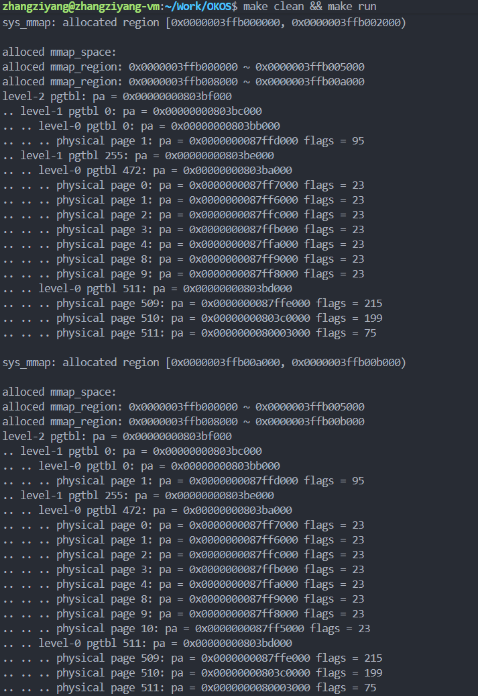
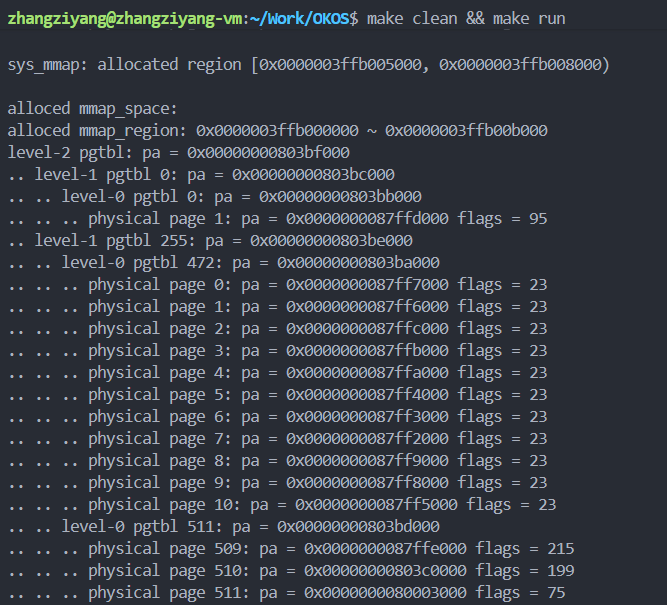
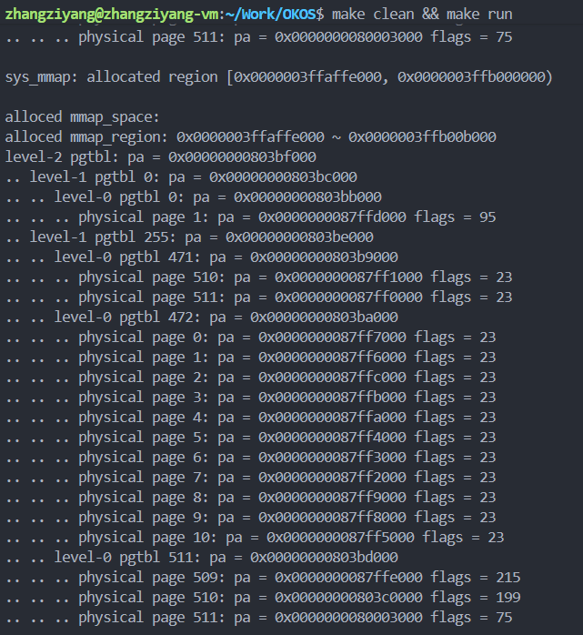
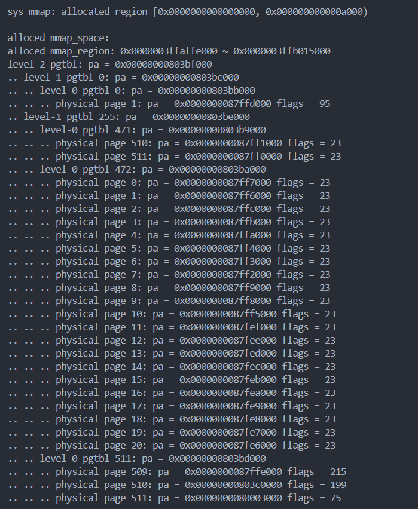

# LAB-5: 系统调用流程建立 + 用户态虚拟内存管理

## 过程日志
1. 2025.11.1 2025.10.13 更新lab4文件


## 代码结构
```
OKOS
├── LICENSE        开源协议
├── .vscode        配置了可视化调试环境
├── registers.xml  配置了可视化调试环境
├── .gdbinit.tmp-riscv xv6自带的调试配置
├── common.mk      Makefile中一些工具链的定义
├── Makefile       编译运行整个项目 (CHANGE, 新增目录syscall)
├── kernel.ld      定义了内核程序在链接时的布局
├── pictures       README使用的图片目录 (CHANGE, 日常更新)
├── README.md      实验报告 (DONE)
├── lab-5-README.md实验指导书 (CHANGE, 日常更新)
└── src            源码
    ├── kernel     内核源码
    │   ├── arch   RISC-V相关
    │   │   ├── method.h
    │   │   ├── mod.h
    │   │   └── type.h
    │   ├── boot   机器启动
    │   │   ├── entry.S
    │   │   └── start.c
    │   ├── lock   锁机制
    │   │   ├── spinlock.c
    │   │   ├── method.h
    │   │   ├── mod.h
    │   │   └── type.h
    │   ├── lib    常用库
    │   │   ├── cpu.c
    │   │   ├── print.c
    │   │   ├── uart.c
    │   │   ├── utils.c
    │   │   ├── method.h
    │   │   ├── mod.h
    │   │   └── type.h
    │   ├── mem    内存模块
    │   │   ├── pmem.c
    │   │   ├── kvm.c
    │   │   ├── uvm.c (DONE, 用户态虚拟内存管理主体)
    │   │   ├── mmap.c (DONE, mmap节点资源仓库)
    │   │   ├── method.h (CHANGE, 日常更新)
    │   │   ├── mod.h
    │   │   └── type.h (CHANGE, 日常更新)
    │   ├── trap   陷阱模块
    │   │   ├── plic.c
    │   │   ├── timer.c
    │   │   ├── trap_kernel.c
    │   │   ├── trap_user.c (DONE, 系统调用处理 + pagefault处理)
    │   │   ├── trap.S
    │   │   ├── trampoline.S
    │   │   ├── method.h
    │   │   ├── mod.h (CHANGE, 日常更新)
    │   │   └── type.h
    │   ├── proc   进程模块
    │   │   ├── proc.c (DONE, proczero->mmap初始化)
    │   │   ├── swtch.S
    │   │   ├── method.h
    │   │   ├── mod.h
    │   │   └── type.h (CHANGE, 进程结构体里新增mmap字段)
    │   ├── syscall 系统调用模块
    │   │   ├── syscall.c (NEW, 系统调用通用逻辑)
    │   │   ├── sysfunc.c (DONE, 各个系统调用的处理逻辑) 
    │   │   ├── method.h (NEW)
    │   │   ├── mod.h (NEW)
    │   │   └── type.h (NEW)
    │   └── main.c
    └── user       用户程序
        ├── initcode.c (CHANGE, 按照测试需求来设置)
        ├── sys.h
        ├── syscall_arch.h
        └── syscall_num.h (CHANGE, 日常更新)
```


## 实现思路 

## 任务1：用户态和内核态的数据迁移

这个任务的核心问题是：用户传的地址是基于用户页表的，但内核用的是内核页表，咋办？

**解决方案很简单：查页表！**

1. **uvm_copyin/uvm_copyout/uvm_copyin_str** (在 `uvm.c` 中)
   - 拿到用户的虚拟地址，通过 `vm_getpte()` 查用户页表
   - 找到对应的物理地址（PTE_TO_PA）
   - 按页拷贝数据，注意处理跨页的情况
   - 字符串拷贝还得找 `\0` 结束符

2. **系统调用处理** (在 `trap_user.c` 中)
   - 用户执行 `ecall` 触发异常 (trap_id=8)
   - `trap_user_handler()` 里调用 `syscall()` 分发到具体的系统调用
   - 系统调用号在 `a7` 寄存器里

3. **具体的系统调用** (在 `sysfunc.c` 中)
   - `sys_copyin()`: 从用户拿数组，逐个打印
   - `sys_copyout()`: 给用户发 [1,2,3,4,5]
   - `sys_copyinstr()`: 从用户拿字符串并打印

**踩过的坑：**
- 用户程序的系统调用宏有递归定义问题，直接删掉那几行
- 入口点偏移 `INITCODE_ENTRY_OFFSET` 要改成 0

## 测试1


## 任务2：堆的手动管理与栈的自动增长

这个任务要给用户进程实现动态内存管理能力,分为两部分:

### 堆的手动管理 - sys_brk系统调用

**堆 (HEAP)** 从低地址向高地址增长,用户通过 `sys_brk` 系统调用来手动管理堆空间。

**sys_brk 的四种功能:**

1. **查询堆顶**: `sys_brk(0)` → 返回当前 `heap_top`
2. **扩展堆**: `sys_brk(new_top)` 且 `new_top > heap_top` → 分配新页面
3. **收缩堆**: `sys_brk(new_top)` 且 `new_top < heap_top` → 释放页面
4. **不变**: `sys_brk(heap_top)` → 什么都不做

**实现要点 (在 `uvm.c` 和 `sysfunc.c` 中):**

1. **uvm_heap_grow()**: 堆扩展
   - 检查边界: 新堆顶不能超过 `MMAP_BEGIN`
   - 页对齐: 用 `PGROUNDUP` 计算需要多少页
   - 分配物理页: `pmem_alloc()` + `memset()` 清零
   - 映射页表: `vm_mappages()` 设置 `PTE_R|PTE_W|PTE_U` 权限
   - 调试输出: 调用 `vm_print()` 显示"look event"和"grow event"

2. **uvm_heap_ungrow()**: 堆收缩
   - 检查下限: 不能收缩到代码段以下 (`USER_BASE + PGSIZE`)
   - 页对齐: 用 `PGROUNDDOWN` 计算要释放多少页
   - 释放页面: `vm_unmappages()` 解除映射并释放物理内存
   - 调试输出: 显示"equal event"(无变化)或"ungrow event"(释放了页)

3. **sys_brk()**: 系统调用处理
   - 参数为0: 返回当前 `heap_top`
   - 扩展/收缩: 调用 `uvm_heap_grow/ungrow` 并更新 `proc->heap_top`
   - 打印日志: 每次操作都输出 "sys_brk: heap grow/shrink/unchanged to 0x..."

### 栈的自动增长 - Page Fault处理

**栈 (STACK)** 从高地址向低地址增长,当访问未分配的栈空间时触发 **Page Fault**,内核自动扩展栈。

**实现要点 (在 `trap_user.c` 和 `uvm.c` 中):**

1. **trap_user_handler()**: 捕获异常
   - 监听 `trap_id = 13` (Load Page Fault) 和 `trap_id = 15` (Store/AMO Page Fault)
   - 读取故障地址: `fault_addr = r_stval()`
   - 调用 `uvm_ustack_grow()` 自动扩展栈
   - 更新进程栈页数: `proc->ustack_npage`

2. **uvm_ustack_grow()**: 栈扩展
   - 计算当前栈范围: `[TRAPFRAME - PGSIZE - ustack_npage*PGSIZE, TRAPFRAME - PGSIZE]`
   - 边界检查: 
     - `fault_addr` 必须在当前栈底下方 (否则不需要扩展)
     - `fault_addr` 不能低于 `MMAP_END` (否则栈溢出)
   - 计算需要扩展的页数: 从 `fault_addr` 向下对齐到页面边界
   - 分配并映射新页面: `pmem_alloc()` + `vm_mappages()` 设置 `PTE_R|PTE_W|PTE_U`
   - 返回新的栈页数

**核心设计理念:**
- 堆是"显式管理": 用户主动调用 `sys_brk`
- 栈是"隐式管理": 触发 Page Fault 自动扩展
- 都使用页对齐宏: `PGROUNDUP` (向上对齐) 和 `PGROUNDDOWN` (向下对齐)

**踩过的坑:**
- 用户代码页的权限问题: 必须加上 `PTE_W` 写权限才能正常工作
  - 修改 `proc.c` 中的映射: `PTE_R|PTE_W|PTE_X|PTE_U`
- 调试输出格式: 需要在关键时刻调用 `vm_print()` 显示页表状态
- 页面对齐计算: 堆扩展用 `PGROUNDUP`,堆收缩和栈扩展都要注意对齐

## 测试2


## 任务3：mmap_region 资源仓库管理

这个任务要解决的问题是：**如何让多个进程安全高效地共享 `mmap_region_t` 结构体资源？**

### 为什么需要离散内存管理？

应用程序除了堆和栈，还需要临时申请一些离散的内存块：
- **栈**：无法手动释放，函数返回后自动回收
- **堆**：适合管理大片连续空间，频繁申请释放会产生碎片化

因此需要在堆和栈之间划分一个 **mmap区域** (`MMAP_BEGIN` ~ `MMAP_END`)，用链表管理离散的内存块。

### 数据结构设计

**1. mmap_region_t**: 描述一块已分配的连续地址空间
```c
typedef struct mmap_region {
    uint64 begin;             // 起始地址
    uint32 npages;            // 页面数量
    struct mmap_region *next; // 链表指针
} mmap_region_t;
```

**2. mmap_region_node_t**: 资源仓库中的包装节点
```c
typedef struct mmap_region_node {
    mmap_region_t mmap;       // 内嵌 mmap_region_t
    struct mmap_region_node *next; // 仓库链表指针
} mmap_region_node_t;
```

**3. 全局资源仓库** (在 `mmap.c` 中):
- `node_list[N_MMAP]`: 256个节点的静态数组
- `list_head`: 空闲链表头节点（不可分配）
- `list_lk`: 自旋锁，保证多核并发安全

### 实现要点

**1. mmap_init()**: 初始化资源仓库
```c
void mmap_init() {
    spinlock_init(&list_lk, "mmap_node_list");
    spinlock_acquire(&list_lk);
    
    // 将 node_list 串成空闲链
    for (int i = 0; i < N_MMAP - 1; i++) {
        node_list[i].next = &node_list[i + 1];
    }
    node_list[N_MMAP - 1].next = NULL;
    list_head.next = &node_list[0];
    
    spinlock_release(&list_lk);
}
```
- 将256个节点串成空闲链表
- 初始化自旋锁
- `list_head.next` 指向第一个可用节点

**2. mmap_region_alloc()**: 从仓库申请节点
```c
mmap_region_t *mmap_region_alloc() {
    spinlock_acquire(&list_lk);
    
    mmap_region_node_t *node = list_head.next;
    if (node == NULL) {
        spinlock_release(&list_lk);
        panic("mmap_region_alloc: no free node");
    }
    list_head.next = node->next;
    
    spinlock_release(&list_lk);
    
    // 清空并返回
    node->mmap.begin = 0;
    node->mmap.npages = 0;
    node->mmap.next = NULL;
    return &node->mmap;
}
```
- 加锁 → 从链表头取节点 → 解锁
- 清空字段并返回指针
- 仓库为空则 `panic`

**3. mmap_region_free()**: 归还节点到仓库
```c
void mmap_region_free(mmap_region_t *mmap) {
    if (mmap == NULL) return;
    
    mmap_region_node_t *node = (mmap_region_node_t *)mmap;
    
    // 清理字段（可选）
    node->mmap.begin = 0;
    node->mmap.npages = 0;
    node->mmap.next = NULL;
    
    spinlock_acquire(&list_lk);
    node->next = list_head.next;
    list_head.next = node;
    spinlock_release(&list_lk);
}
```
- 清空 mmap 字段
- 加锁 → 头插法插入链表 → 解锁
- O(1) 复杂度

### 核心设计理念

- **对象池模式**: 预分配固定数量的节点，避免频繁的物理页分配
- **空闲链表**: 已释放的节点不归还物理内存，加入空闲链表等待复用
- **自旋锁保护**: 多核环境下保证资源申请/释放的原子性
- **结构体嵌套技巧**: `mmap_region_t` 是 `mmap_region_node_t` 的首成员，地址相同，可直接指针转换

### 踩过的坑

- **指针转换**: `mmap_region_free()` 接收 `mmap_region_t*`，需转换为 `mmap_region_node_t*`
  - 因为 `mmap` 是首成员，地址相同，可以直接强制转换：`(mmap_region_node_t *)mmap`
- **锁的粒度**: 必须在访问 `list_head.next` 前后正确加锁/解锁
- **边界检查**: `mmap_region_alloc()` 必须检查仓库是否为空

## 测试3
测试逻辑：双核并发申请和释放256个节点

**测试代码** (在 `main.c` 中):
- CPU0 申请节点 0~127，CPU1 申请节点 128~255
- 同步屏障后再并发释放
- 检查初始和最终状态的节点链表完整性

**预期输出**:
- 初始状态: `node 0 index = 0`, `node 1 index = 1`, ..., `node 255 index = 255`
- 最终状态: 两股输出交替，node从0到255，一股index从255减到128，另一股index从127减到0


## 任务4：mmap 与 munmap 系统调用

这个任务实现用户态的离散内存管理，允许用户动态申请和释放 mmap 区域的内存。

### 核心功能

**sys_mmap(begin, len)**: 申请一块连续的内存空间
- `begin=0`: 内核自动寻找第一个足够大的空闲区域
- `begin!=0`: 在指定地址申请（需要页对齐）
- `len`: 申请的字节数（必须是 PGSIZE 的倍数）

**sys_munmap(begin, len)**: 释放指定地址范围的内存
- 支持部分释放、完全释放、中间打洞等复杂情况
- 自动处理链表节点的分裂和删除

### 实现要点

**1. uvm_mmap_find()**: 自动寻找空闲空间
- 从 `MMAP_BEGIN` 开始扫描已分配区域之间的空隙
- 返回第一个足够大的空闲区域起始地址
- 同时返回插入位置的前后节点指针

**2. uvm_mmap()**: 分配 mmap 区域

核心步骤：
- **查找位置**: `begin=0` 时调用 `uvm_mmap_find()`，否则在链表中找到插入位置
- **创建节点**: 从资源仓库分配 `mmap_region_t`，设置 `begin`、`npages`
- **插入链表**: 保持链表按地址有序
- **合并相邻节点**: 
  - 与前一个节点相邻 → 扩展前节点，释放新节点，**更新链表**
  - 与后一个节点相邻 → 扩展新节点，释放后节点，**更新链表**
- **分配物理页**: 调用 `pmem_alloc()` 并用 `vm_mappages()` 建立映射

**关键点 - 合并时必须更新链表指针：**
```c
// 与前面合并
last_mmap->npages += new_mmap->npages;
last_mmap->next = new_mmap->next;  // ← 重要！
mmap_region_free(new_mmap);

// 与后面合并  
new_mmap->npages += next_mmap->npages;
new_mmap->next = next_mmap->next;  // ← 重要！
mmap_region_free(next_mmap);
```

**3. uvm_munmap()**: 释放 mmap 区域

需要处理4种情况：

- **情况1 - 完全包含**: 解除整个节点的映射，从链表删除并释放节点
- **情况2 - 覆盖前半**: 解除前半映射，修改节点 `begin` 和 `npages`
- **情况3 - 覆盖后半**: 解除后半映射，修改节点 `npages`
- **情况4 - 中间打洞**: 解除中间映射，分裂成两个节点

**4. 系统调用实现**

**sys_mmap()**:
- 参数检查：`len` 和 `begin` 必须页对齐
- 调用 `uvm_mmap(begin, npages, PTE_R|PTE_W|PTE_U)`
- 打印调试信息和页表状态

**sys_munmap()**:
- 参数检查：`len` 和 `begin` 必须页对齐
- 调用 `uvm_munmap(begin, npages)`
- 打印调试信息和页表状态

### 核心设计理念

- **链表有序性**: mmap 链表始终按地址从低到高排序
- **节点合并**: 相邻的节点自动合并，减少资源仓库的消耗
- **资源复用**: 释放的 `mmap_region_t` 归还到资源仓库而非物理内存
- **灵活释放**: 支持任意范围的 munmap，自动处理节点分裂

### 踩过的坑

- **合并后忘记更新链表指针**: 合并节点后如果不更新 `next` 指针，会导致链表结构破坏
  - 症状：所有 mmap 区域显示相同的地址
  - 解决：每次 `mmap_region_free()` 后必须更新前一个节点的 `next`
  
- **munmap 的边界情况**: 必须仔细处理 4 种覆盖情况，特别是中间打洞
  - 需要分配新节点表示后半部分
  - 需要正确连接链表

- **物理页映射**: mmap 时必须分配物理页并建立映射，munmap 时必须解除映射并释放物理页

## 测试4
测试用例涵盖了 mmap/munmap 的各种复杂情况：
- 指定地址的 mmap
- 自动寻址的 mmap (`begin=0`)
- 相邻节点自动合并
- 部分释放、完全释放、中间打洞

每次操作后都会打印：
- 分配/释放的地址范围
- 当前 mmap 链表状态（所有已分配区域）
- 页表详细状态（三级页表结构）








## 任务5：页表复制与销毁

这个任务实现进程页表的深拷贝和完整销毁，是 fork 系统调用的核心基础。

### 核心功能

**uvm_copy_pgtbl(old, new, heap_top, ustack_npage, mmap)**: 将旧页表的内容完整复制到新页表
- 复制用户代码段、堆、mmap 区域、用户栈
- 为每个页面分配新的物理内存并复制数据
- 不复制 trapframe 和 trampoline（内核管理）

**uvm_destroy_pgtbl(pgtbl)**: 完全销毁页表，释放所有资源
- 递归释放三级页表结构
- 释放所有用户物理页面
- 释放页表本身占用的物理页

### 实现要点

**1. copy_range()**: 复制连续虚拟地址空间的辅助函数

```c
static void copy_range(pgtbl_t old, pgtbl_t new, uint64 begin, uint64 end)
{
    for (va = begin; va < end; va += PGSIZE) {
        // 获取旧页表中的 PTE
        pte = vm_getpte(old, va, false);
        
        // 获取物理地址和标志位
        pa = PTE_TO_PA(*pte);
        flags = PTE_FLAGS(*pte);
        
        // 分配新物理页并复制数据
        page = pmem_alloc(false);
        memmove((char *)page, (const char *)pa, PGSIZE);
        
        // 在新页表中建立映射
        vm_mappages(new, va, page, PGSIZE, flags);
    }
}
```

**2. uvm_copy_pgtbl()**: 页表复制的主函数

分4个步骤复制整个地址空间：

```c
void uvm_copy_pgtbl(pgtbl_t old, pgtbl_t new, uint64 heap_top, 
                    uint64 ustack_npage, mmap_region_t *mmap)
{
    // 1. 复制用户代码页 (USER_BASE 一页)
    copy_range(old, new, USER_BASE, USER_BASE + PGSIZE);
    
    // 2. 复制堆空间 [USER_BASE + PGSIZE, heap_top)
    if (heap_top > USER_BASE + PGSIZE) {
        uint64 heap_start = USER_BASE + PGSIZE;
        // 向上对齐到页边界
        uint64 heap_end = (heap_top + PGSIZE - 1) & ~(PGSIZE - 1);
        copy_range(old, new, heap_start, heap_end);
    }
    
    // 3. 复制 mmap 区域（遍历链表）
    mmap_region_t *tmp = mmap;
    while (tmp != NULL) {
        uint64 mmap_start = tmp->begin;
        uint64 mmap_end = tmp->begin + tmp->npages * PGSIZE;
        copy_range(old, new, mmap_start, mmap_end);
        tmp = tmp->next;
    }
    
    // 4. 复制用户栈 [TRAPFRAME - ustack_npage * PGSIZE, TRAPFRAME)
    uint64 ustack_start = TRAPFRAME - ustack_npage * PGSIZE;
    copy_range(old, new, ustack_start, TRAPFRAME);
}
```

**设计要点**：
- **不复制 trapframe/trampoline**：这些是内核资源，在 `proc_pgtbl_init()` 中单独处理
- **堆顶对齐**：`heap_top` 可能不是页对齐的，需要向上对齐
- **遍历 mmap 链表**：每个 mmap 区域可能不连续，需要逐个复制
- **动态栈大小**：根据 `ustack_npage` 计算栈的实际大小

**3. destroy_pgtbl()**: 递归释放页表的辅助函数

```c
static void destroy_pgtbl(pgtbl_t pgtbl, uint32 level)
{
    for (int i = 0; i < 512; i++) {
        pte_t pte = pgtbl[i];
        
        if (pte & PTE_V) {
            uint64 child_pa = PTE_TO_PA(pte);
            
            if (level > 1) {
                // 非叶子节点：递归释放下一级页表
                destroy_pgtbl((pgtbl_t)child_pa, level - 1);
            } else {
                // 叶子节点(level == 1)：释放物理页
                if (pte & PTE_U) {
                    // 用户页面，可以释放
                    pmem_free(child_pa, false);
                }
                // 内核页面(如 trampoline)不释放
            }
        }
    }
    
    // 释放当前页表本身
    pmem_free((uint64)pgtbl, true);
}
```

**递归逻辑**：
- **Level 3**: 顶级页表，包含 512 个指向 Level 2 页表的指针
- **Level 2**: 中级页表，包含 512 个指向 Level 1 页表的指针
- **Level 1**: 叶子页表，包含 512 个指向物理页的指针
  - 检查 `PTE_U` 标志：用户页释放，内核页保留

**为什么要检查 PTE_U？**
- Trampoline 页面是内核共享资源，所有进程共用，不能释放
- 用户代码、数据、栈都是进程独有的，必须释放

**4. uvm_destroy_pgtbl()**: 页表销毁的入口函数

```c
void uvm_destroy_pgtbl(pgtbl_t pgtbl)
{
    // 解除 trapframe 和 trampoline 的映射
    vm_unmappages(pgtbl, TRAPFRAME, PGSIZE, false);  // trapframe 不释放物理页
    vm_unmappages(pgtbl, TRAMPOLINE, PGSIZE, false); // trampoline 不释放物理页
    
    // 递归释放整个页表结构（从 level 3 开始）
    destroy_pgtbl(pgtbl, 3);
}
```

**注意事项**：
- **Trapframe 不释放物理页**：在测试场景中，新页表可能共享原进程的 trapframe
- **先解除映射**：`vm_unmappages` 会将 PTE 置为 0，防止 `destroy_pgtbl` 重复处理
- **递归释放**：从顶级页表开始，自顶向下释放所有层级

### 核心设计理念

**页表复制的本质**：
- 创建地址空间的完整副本
- 物理内存完全独立（写时不复制）
- 虚拟地址布局保持一致

**为什么需要逐页复制？**
- **独立性**：父子进程各自修改不会相互影响
- **简单性**：不需要实现写时复制（COW）机制
- **完整性**：堆栈、数据、代码全部复制

**三级页表的递归处理**：
```
Level 3 (root)
  ├─ Level 2 (512 entries)
  │   ├─ Level 1 (512 entries)
  │   │   ├─ Physical Page 0
  │   │   ├─ Physical Page 1
  │   │   └─ ...
  │   └─ ...
  └─ ...
```
- 释放顺序：先释放叶子物理页 → 再释放 Level 1 页表 → 再释放 Level 2 页表 → 最后释放 Level 3 页表
- 递归天然保证了正确的释放顺序

### 踩过的坑

**1. 堆顶页对齐问题**
- **错误**：直接使用 `heap_top` 作为 `copy_range` 的结束地址
- **后果**：编译错误，`PGROUNDUP` 宏未定义
- **解决**：手动页对齐 `(heap_top + PGSIZE - 1) & ~(PGSIZE - 1)`

**2. 头文件包含问题**
- **错误**：`sys_test_pgtbl` 中调用 `proc_pgtbl_init()` 未声明
- **后果**：隐式声明导致编译错误
- **解决**：在 `syscall/mod.h` 中添加 `#include "../proc/mod.h"`

**3. Trapframe 释放问题**
- **错误**：在 `destroy_pgtbl` 中尝试释放 trapframe 的物理页
- **后果**：`pmem_free: page out of range` panic
- **原因**：测试中新页表共享原进程的 trapframe，物理地址在页表区域（`0x803xxxxx`）
- **解决**：`uvm_destroy_pgtbl` 中使用 `vm_unmappages(..., false)` 不释放物理页

### 调试技巧

**打印页表内容验证复制**：
```c
printf("Source page table:\n");
vm_print(old_pgtbl);

uvm_copy_pgtbl(old, new, heap_top, ustack_npage, mmap);

printf("Copied page table:\n");
vm_print(new_pgtbl);
```
- 对比物理地址：复制后应该是不同的物理页（地址不同）
- 对比虚拟地址：虚拟地址范围应该完全相同
- 对比标志位：权限标志应该一致

**分段测试**：
1. 先只复制代码段，验证 `copy_range` 是否正确
2. 再添加堆复制，验证页对齐逻辑
3. 添加 mmap 复制，验证链表遍历
4. 最后添加栈复制，验证完整性

## 测试5

测试用例验证了页表复制和销毁的正确性：

**测试步骤**：
1. **准备数据**：在堆、mmap、栈中写入测试数据
   - 堆：`0x12345678`, `0xABCDEF00`, `0x99887766`
   - Mmap 区域1：`0xDEADBEEF`, `0xCAFEBABE`
   - Mmap 区域2：`0x11223344`, `0x55667788`
   - 栈：字符 `'H'`, `'W'`, `'!'`

2. **触发栈扩展**：分配 2 页的栈数组触发 page fault

3. **页表复制**：
   - 创建新页表
   - 复制所有用户内存区域
   - 打印新页表内容验证

4. **页表销毁**：
   - 递归释放所有页表和物理页
   - 验证没有内存泄漏或 panic

**验证要点**：
- 复制后的页表应该有不同的物理地址
- 虚拟地址布局应该完全一致
- Trapframe 和 trampoline 的映射正确
- 销毁过程没有释放内核共享资源

**测试结果**：


## 实验感想
