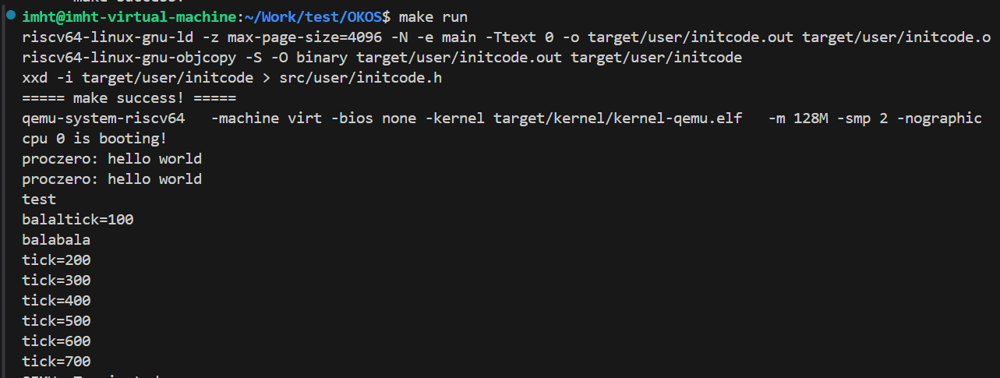

# LAB-4 实验报告

## 过程日志
1. 2025.10.20 更新lab4文件
2. 2025.10.20 张子扬初步完成实验，存在panic问题  
3. 2025.10.23 王俊翔完善实验修改存在的错误版本 
4. 2025.10.27 王俊翔完成测试二剩余部分

## 代码组织结构
```
OKOS
├── LICENSE        开源协议
├── .vscode        配置了可视化调试环境
├── registers.xml  配置了可视化调试环境
├── .gdbinit.tmp-riscv xv6自带的调试配置
├── common.mk      Makefile中一些工具链的定义
├── Makefile       编译运行整个项目
├── kernel.ld      定义了内核程序在链接时的布局 (CHANGE, 支持trampsec)
├── pictures       README使用的图片目录 (CHANGE, 日常更新)
├── README.md      实验报告 (DONE)
├── lab4-README.md 实验指导书 (CHANGE, 日常更新)
└── src            源码
    ├── kernel     内核源码
    │   ├── arch   RISC-V相关
    │   │   ├── method.h
    │   │   ├── mod.h
    │   │   └── type.h
    │   ├── boot   机器启动
    │   │   ├── entry.S
    │   │   └── start.c
    │   ├── lock   锁机制
    │   │   ├── spinlock.c
    │   │   ├── method.h
    │   │   ├── mod.h
    │   │   └── type.h
    │   ├── lib    常用库
    │   │   ├── cpu.c (CHANGE, 新增myproc函数)
    │   │   ├── print.c
    │   │   ├── uart.c
    │   │   ├── utils.c
    │   │   ├── method.h (CHANGE, 新增myproc函数)
    │   │   ├── mod.h
    │   │   └── type.h (CHANGE, 扩充CPU结构体 + 帮助)
    │   ├── mem    内存模块
    │   │   ├── pmem.c
    │   │   ├── kvm.c (DONE, 增加内核页表的映射内容 trampoline + KSTACK(0))
    │   │   ├── method.h
    │   │   ├── mod.h
    │   │   └── type.h
    │   ├── trap   陷阱模块
    │   │   ├── plic.c
    │   │   ├── timer.c
    │   │   ├── trap_kernel.c (CHANGE, 去掉了提示信息的static标记)
    │   │   ├── trap_user.c (DONE, 用户态陷阱处理)
    │   │   ├── trap.S
    │   │   ├── trampoline.S
    │   │   ├── method.h (CHANGE, 增加函数定义)
    │   │   ├── mod.h
    │   │   └── type.h
    │   ├── proc   进程模块
    │   │   ├── proc.c (DONE, 进程管理核心逻辑)
    │   │   ├── swtch.S (NEW, 上下文切换)
    │   │   ├── method.h (NEW)
    │   │   ├── mod.h (NEW)
    │   │   └── type.h (NEW)
    │   └── main.c (CHANGE, 日常更新)
    └── user       用户程序
        ├── initcode.c (NEW)
        ├── sys.h (NEW)
        ├── syscall_arch.h (NEW)
        └── syscall_num.h (NEW)
```

## 核心概念讲解

### 1. 进程控制块 (PCB) 结构

进程控制块是操作系统管理进程的核心数据结构，在我们的实现中对应 `proc_t` 结构：

```
+----------------------+
|      proc_t          |
+----------------------+
| pid: 进程ID          |
| state: 进程状态      |
| kstack: 内核栈指针   |
| pgtbl: 用户页表      |
| tf: trapframe指针    |
| ctx: 上下文          |
| ustack_npage: 用户栈页数|
| heap_top: 堆顶地址   |
+----------------------+
```

### 2. Trapframe 结构详解

Trapframe 保存用户态到内核态切换时的寄存器状态：

```
+----------------------+
|    trapframe_t       |
+----------------------+
| user_to_kern_satp    | 内核页表
| user_to_kern_sp      | 内核栈指针
| user_to_kern_trapvector| trap处理函数
| user_to_kern_epc     | 用户程序入口点
| user_to_kern_hartid  | 硬件线程ID
| sp                   | 用户栈指针
| ra, sp, gp, tp...    | 通用寄存器
| a0-a7                | 参数寄存器
| s0-s11               | 保存寄存器
| t0-t6                | 临时寄存器
+----------------------+
```

## 实现思路

本实验实现了从内核态到用户态的切换，核心思路如下：

### 1. 进程管理框架
- 在 [`proc.c`](OKOS/src/kernel/proc/proc.c) 中实现进程控制块 (proc_t) 管理
- 创建第一个用户进程 `proczero`，负责执行 initcode
- 实现进程上下文切换机制

### 2. 用户地址空间构建
- 用户页表构建在 [`proc_pgtbl_init()`](OKOS/src/kernel/proc/proc.c:32)
- 关键映射：
  - **Trampoline**: 映射到 `VA_MAX - PGSIZE`，用于用户-内核切换
  - **Trapframe**: 映射到 `TRAMPOLINE - PGSIZE`，保存用户寄存器状态
  - **用户栈**: 映射到 `TRAPFRAME - PGSIZE`
  - **用户代码**: 映射到 `PGSIZE = 0x1000`

### 3. 用户态执行入口
- 在 [`proc_make_first()`](OKOS/src/kernel/proc/proc.c:65) 中设置：
  - `p->tf->user_to_kern_epc = 0x102c` (initcode 入口点)
  - 内核栈指针、trap 处理向量等关键信息

### 4. 用户-内核切换机制
- **Trampoline**: 在 [`trampoline.S`](OKOS/src/kernel/trap/trampoline.S) 中实现
  - `user_vector`: 用户态 trap 进入内核
  - `user_return`: 内核返回用户态
- **Trap 处理**: 在 [`trap_user.c`](OKOS/src/kernel/trap/trap_user.c) 中实现系统调用处理

## 执行流程详解

### 1. 进程创建阶段 (`proc_make_first`)

**状态变化**:
```
内核态 → 准备用户环境 → 设置 trapframe → 准备切换
```

**代码流程**:
```c
// 1. 分配 trapframe 内存
p->tf = pmem_alloc(true);

// 2. 创建用户页表
p->pgtbl = proc_pgtbl_init((uint64)p->tf);

// 3. 映射用户栈和代码页
vm_mappages(p->pgtbl, USTACK, ustack_pa, PGSIZE, PTE_R|PTE_W|PTE_U);
vm_mappages(p->pgtbl, PGSIZE, ucode_pa, PGSIZE, PTE_R|PTE_X|PTE_U);

// 4. 设置 trapframe 关键字段
p->tf->user_to_kern_epc = 0x102c;  // 用户程序入口
p->tf->sp = USTACK + PGSIZE;       // 用户栈顶

// 5. 切换到用户态
trap_user_return();
```

### 2. 用户态返回阶段 (`trap_user_return`)

**状态变化**:
```
内核态 → 设置 trap 向量 → 设置用户页表 → 执行 sret → 用户态
```

**关键寄存器设置**:
- `stvec`: 指向 trampoline 的 `user_vector`
- `sscratch`: 设置为 `TRAPFRAME` 虚拟地址
- `sstatus`: 清除 SPP，设置 SPIE
- `sepc`: 设置为 `0x102c` (用户程序入口)

### 3. 用户程序执行阶段

**状态变化**:
```
用户态执行 → 调用 helper(0) → 执行 ecall → 触发 trap
```

**用户程序流程**:
```c
main() {
    helper(0);  // 第一次系统调用
    helper(0);  // 第二次系统调用
    while(1);   // 无限循环
}

helper(arg) {
    a7 = arg;   // 设置系统调用号
    ecall;      // 触发系统调用
    return a0;  // 返回系统调用结果
}
```

### 4. 系统调用处理阶段

**状态变化**:
```
用户态 → 硬件 trap → trampoline → 内核态 → 处理系统调用 → 返回用户态
```

**详细流程**:

1. **硬件自动操作**:
   - 保存 `sepc` (当前 PC)
   - 设置 `scause = 8` (U-mode ecall)
   - 跳转到 `stvec` 指向的 trampoline

2. **Trampoline 处理** (`user_vector`):
   ```asm
   csrrw a0, sscratch, a0  ; 交换 a0 和 sscratch
   sd ra, 40(a0)           ; 保存所有寄存器到 trapframe
   sd sp, 48(a0)
   ...                     ; 保存其他寄存器
   ld sp, 8(a0)            ; 加载内核栈指针
   ld t0, 16(a0)           ; 加载 trap 处理函数
   jr t0                   ; 跳转到 trap_user_handler
   ```

3. **内核系统调用处理** (`trap_user_handler`):
   ```c
   // 识别 ecall from U-mode
   if (trap_id == 8) {
       tf->user_to_kern_epc += 4;  // 跳过 ecall 指令
       if (tf->a7 == 0) {
           printf("proczero: hello world\n");
       }
   }
   ```

4. **返回用户态** (`trap_user_return`):
   - 恢复用户寄存器
   - 切换到用户页表
   - 执行 `sret` 返回用户程序

## 关键代码片段

### 1. 进程创建与初始化 ([`proc.c`](OKOS/src/kernel/proc/proc.c:65))
```c
void proc_make_first()
{
    // 分配 trapframe
    p->tf = (trapframe_t *)pmem_alloc(true);
    
    // 创建用户页表
    p->pgtbl = proc_pgtbl_init((uint64)p->tf);
    
    // 映射用户栈和代码页
    vm_mappages(p->pgtbl, USTACK, (uint64)ustack_pa, PGSIZE, PTE_R | PTE_W | PTE_U);
    vm_mappages(p->pgtbl, PGSIZE, (uint64)ucode_pa, PGSIZE, PTE_R | PTE_X | PTE_U);
    
    // 设置 trapframe 关键字段
    p->tf->user_to_kern_epc = PGSIZE + INITCODE_ENTRY_OFFSET;  // 0x102c
    p->tf->sp = USTACK + PGSIZE;  // 用户栈顶
    
    // 切换到用户态
    trap_user_return();
}
```

### 2. 用户态返回 ([`trap_user.c`](OKOS/src/kernel/trap/trap_user.c:76))
```c
void trap_user_return()
{
    // 设置 stvec 指向 trampoline
    w_stvec(uservec_va);
    
    // 设置 sscratch 为 TRAPFRAME 地址
    w_sscratch((uint64)TRAPFRAME);
    
    // 设置 sstatus 为 U-mode
    s &= ~SSTATUS_SPP;
    s |= SSTATUS_SPIE;
    w_sstatus(s);
    
    // 设置 sepc 为用户程序入口
    w_sepc(tf->user_to_kern_epc);
    
    // 跳转到 trampoline 执行返回
    ureturn((trapframe_t *)TRAPFRAME, MAKE_SATP(p->pgtbl));
}
```

### 3. 系统调用处理 ([`trap_user.c`](OKOS/src/kernel/trap/trap_user.c:25))
```c
void trap_user_handler()
{
    // 识别 U-mode ecall (scause = 8)
    if (trap_id == 8) {
        tf->user_to_kern_epc += 4;  // 跳过 ecall 指令
        if (tf->a7 == 0) {
            printf("proczero: hello world\n");
        }
    }
}
```

### 寻找initcode入口：
虚拟地址映射：initcode 二进制被映射到用户虚拟页 PGSIZE = 0x1000，反汇编中偏移 0x2c 对应运行时地址 0x102c

```c
unsigned char target_user_initcode[] = {
  0x13, 0x01, 0x01, 0xfe, 0x23, 0x3c, 0x81, 0x00, 0x13, 0x04, 0x01, 0x02,
  0x23, 0x34, 0xa4, 0xfe, 0x83, 0x38, 0x84, 0xfe, 0x73, 0x00, 0x00, 0x00,
  0x93, 0x07, 0x05, 0x00, 0x13, 0x85, 0x07, 0x00, 0x03, 0x34, 0x81, 0x01,
  0x13, 0x01, 0x01, 0x02, 0x67, 0x80, 0x00, 0x00, 0x13, 0x01, 0x01, 0xff,
  0x23, 0x34, 0x11, 0x00, 0x23, 0x30, 0x81, 0x00, 0x13, 0x04, 0x01, 0x01,
  0x13, 0x05, 0x00, 0x00, 0x97, 0x00, 0x00, 0x00, 0xe7, 0x80, 0x00, 0xfc,
  0x13, 0x05, 0x00, 0x00, 0x97, 0x00, 0x00, 0x00, 0xe7, 0x80, 0x40, 0xfb,
  0x6f, 0x00, 0x00, 0x00
};
```

把以上的汇编翻译成C的伪代码如下，方便理解分析：
```c
// 地址 0x1000 + 0x0（反汇编偏移 0x0）
// helper routine，作用：把传入的参数放到 a7，然后触发 ecall，返回 a0
long helper(long arg /* in a0 */) {
    // prologue: push/alloc frame (sp -= 32), save s0, set fp
    // sd x8, 24(sp); fp = sp + 32;
    // store arg into frame: store a0 at frame offset
    long saved_arg = arg;           // sd x10, -24(fp)
    long a7 = saved_arg;            // ld x17, -24(fp) -> x17 = a7
    // syscall:
    syscall();                      // ecall
    // after ecall: move return into a0 as needed (mv x15,x10; mv x10,x15)
    long ret = /* a0 after ecall */;
    // epilogue: restore s0, free frame, return
    return ret;                     // ret
}
// 地址 0x1000 + 0x2c（反汇编偏移 0x2c）
// main entry，程序入口，从这里开始执行（所以 EPC 要指向这里）
int main(void) {
    // prologue: sp -= 16; save ra, save s0; fp = sp + 16
    // prepare first call
    long a0 = 0;
    helper(a0);      // auipc + jalr -> 调用 helper 位于同一页的 0x0 处 (位置无关调用)
    // prepare second call
    a0 = 0;
    helper(a0);      // 再一次调用 helper
    // finished: busy loop
    for(;;) { /* spin */ }  // j 0x54
}
```

## 测试样例

通过测试样例，我们实现了以下的目标：
1.  验证系统调用功能：
    *   创建并运行第一个用户进程 `proczero`。
    *   `proczero` 执行的用户程序 (`initcode.c`) 会发起两次 `SYS_helloworld` 系统调用。
    *   内核捕获到这个来自用户态的 `ecall` 异常后，会进行处理，并打印出 "proczero: hello world!"。
    *   这个测试证明了用户进程能够通过系统调用与内核进行交互，并获得内核提供的服务。

2.  **验证用户态下的中断处理**：
    *   在用户进程 `proczero` 运行时，测试系统是否还能正确响应外部中断——时钟中断和串口中断。
    *   这确保了在引入用户态后，原有的中断处理机制依然能够正常工作，CPU可以从用户态正确陷入内核来响应中断，并在处理完毕后返回用户态继续执行。

总而言之，测试样例验证了从内核态到用户态的切换、用户进程的执行、系统调用的完整处理流程以及在用户态下中断响应的正确性。

## 五、设计取舍与反思

### 1. 入口点选择的理解
- **正确选择**: 偏移 `0x2c` 作为入口点，而不是 `0x0`
- **原因分析**: `0x0` 是 helper 函数，负责系统调用封装；`0x2c` 是 main 函数，是用户程序的逻辑入口
- **验证**: 在 [`proc_make_first()`](OKOS/src/kernel/proc/proc.c:102) 中正确设置 `user_to_kern_epc = 0x102c`

### 2. 地址空间布局设计
- **用户空间布局**:
  ```
  高地址: TRAMPOLINE (0x3fffffe000) - 用户-内核切换代码
          TRAPFRAME  (0x3fffffd000)  - 用户寄存器保存区
          USTACK     (0x3fffffc000)  - 用户栈
          ...
          CODE+DATA  (0x00001000)    - 用户代码和数据
  低地址: 未映射区域 (0x00000000)     - 防止空指针访问
  ```
- **设计优势**: 符合 RISC-V 标准，隔离性好，便于内存管理

### 3. 用户-内核切换机制
- **Trampoline 设计**: 在 [`trampoline.S`](OKOS/src/kernel/trap/trampoline.S) 中实现
  - 优点: 代码位置固定，页表切换安全
  - 挑战: 寄存器保存/恢复的精确性
- **Trapframe 设计**: 在 [`trap_user.c`](OKOS/src/kernel/trap/trap_user.c) 中管理
  - 包含完整的用户寄存器状态
  - 保存内核执行环境信息

### 4. 系统调用流程优化
- **硬件自动操作**:
  - 保存 `sepc` (发生 trap 的用户 PC)
  - 设置 `scause` (trap 原因)
  - 跳转到 `stvec` 指向地址
- **软件处理流程**:
  - Trampoline 保存用户寄存器
  - 内核处理系统调用
  - 恢复用户状态并返回

### 5. 关键调试经验
- **入口点确认**: 通过反汇编分析确认 `0x102c` 是正确入口
- **寄存器保存**: 确保 trampoline 中所有寄存器正确保存/恢复
- **页表切换**: 在 trampoline 中安全切换页表，避免地址失效

### 6. 设计反思
- **成功之处**:
  - 完整的用户-内核切换机制
  - 清晰的地址空间隔离
  - 稳定的系统调用流程
- **改进空间**:
  - 可扩展更多系统调用类型
  - 优化 trampoline 性能
  - 增强错误处理和调试信息

通过本次实验，深入理解了操作系统用户态与内核态的切换机制，掌握了 RISC-V 架构下的 trap 处理流程，为后续的多进程管理和系统调用扩展奠定了基础。
