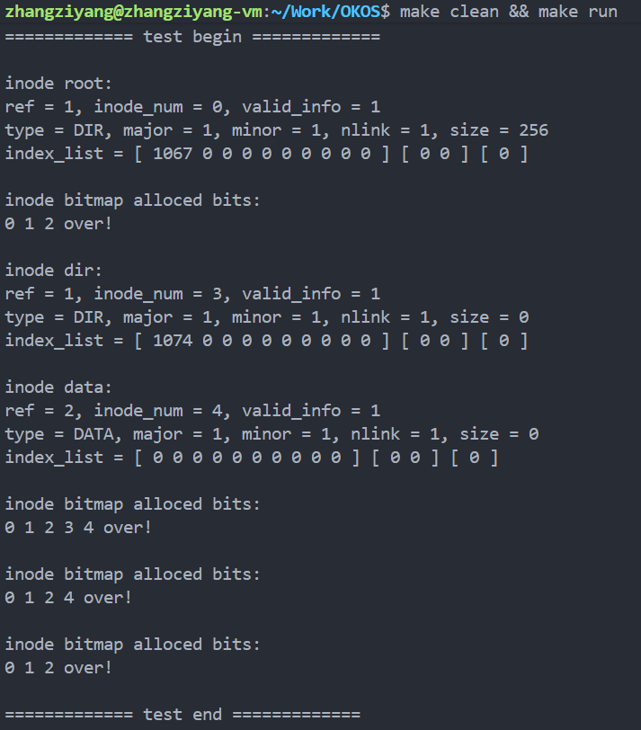
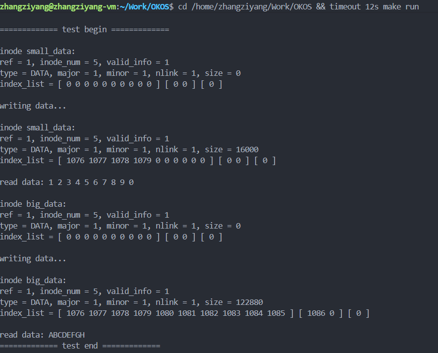
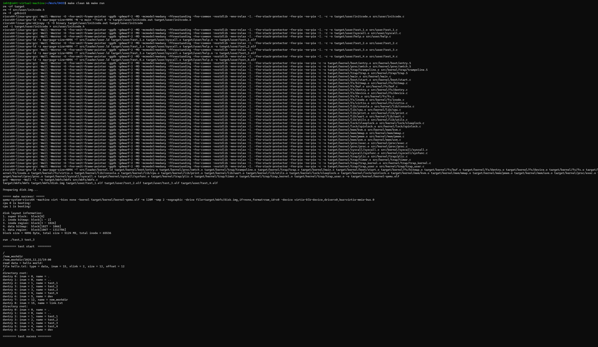
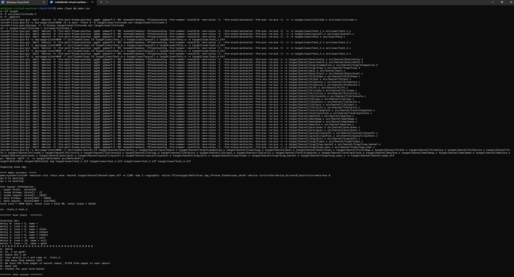
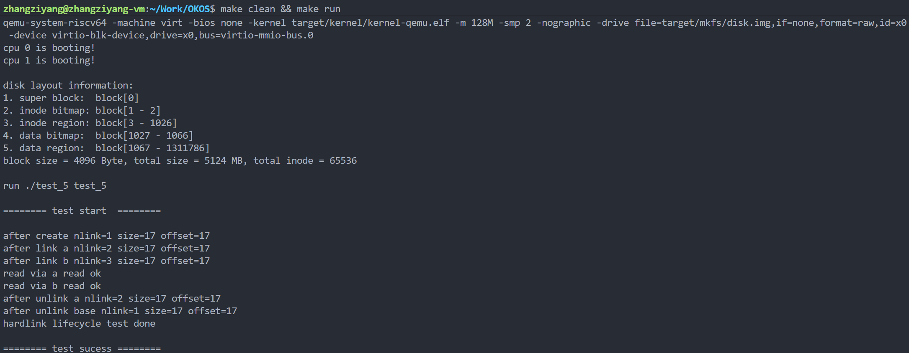

# LAB-8: 文件系统 之 数据组织与层次结构

## 过程日志
1. 2025.12.14 更新 lab8 文件
2. 2025.12.15 张子扬完成实验 4 个 test
3. 2025.12.22 王俊翔完善 README，张子扬增加测试5


## 代码结构
```
ECNU-OSLAB-2025-TASK
├── LICENSE        开源协议
├── .vscode        配置了可视化调试环境
├── registers.xml  配置了可视化调试环境
├── .gdbinit.tmp-riscv xv6自带的调试配置
├── common.mk      Makefile中一些工具链的定义
├── Makefile       编译运行整个项目
├── kernel.ld      定义了内核程序在链接时的布局
├── picture        README使用的图片目录 (CHANGE)
├── lab-8-README.md 实验指导书 (CHANGE)
├── README.md      实验报告 (DONE)
└── src            源码
	├── kernel     内核源码
	│   ├── arch   RISC-V相关
	│   │   ├── method.h
	│   │   ├── mod.h
	│   │   └── type.h
	│   ├── boot   机器启动
	│   │   ├── entry.S
	│   │   └── start.c
	│   ├── lock   锁机制
	│   │   ├── spinlock.c
	│   │   ├── sleeplock.c
	│   │   ├── method.h
	│   │   ├── mod.h
	│   │   └── type.h
	│   ├── lib    常用库
	│   │   ├── cpu.c
	│   │   ├── print.c
	│   │   ├── uart.c
	│   │   ├── utils.c (CHANGE, 新增strlen函数)
	│   │   ├── method.h (CHANGE)
	│   │   ├── mod.h
	│   │   └── type.h
	│   ├── mem    内存模块
	│   │   ├── pmem.c
	│   │   ├── kvm.c
	│   │   ├── uvm.c
	│   │   ├── mmap.c
	│   │   ├── method.h
	│   │   ├── mod.h
	│   │   └── type.h
	│   ├── trap   陷阱模块
	│   │   ├── plic.c
	│   │   ├── timer.c
	│   │   ├── trap_kernel.c
	│   │   ├── trap_user.c
	│   │   ├── trap.S
	│   │   ├── trampoline.S
	│   │   ├── method.h
	│   │   ├── mod.h
	│   │   └── type.h
	│   ├── proc   进程模块
	│   │   ├── proc.c
	│   │   ├── swtch.S
	│   │   ├── method.h
	│   │   ├── mod.h
	│   │   └── type.h
	│   ├── syscall 系统调用模块
	│   │   ├── syscall.c
	│   │   ├── sysfunc.c
	│   │   ├── method.h
	│   │   ├── mod.h
	│   │   └── type.h
	│   ├── fs     文件系统模块
	│   │   ├── bitmap.c
	│   │   ├── buffer.c
	│   │   ├── inode.c (DONE)
	│   │   ├── dentry.c (DONE)
	│   │   ├── fs.c (DONE)
	│   │   ├── virtio.c
	│   │   ├── method.h (CHANGE)
	│   │   ├── mod.h
	│   │   └── type.h (CHANGE)
	│   └── main.c
	├── mkfs       磁盘映像初始化
	│   ├── mkfs.c (CHANGE, 更复杂的文件系统初始化)
	│   └── mkfs.h (CHANGE)
	└── user       用户程序
	    ├── initcode.c
	    ├── sys.h
	    ├── syscall_arch.h
	    └── syscall_num.h
```


## 核心思考与架构设计

本实验在 lab-7 的 block-level 磁盘管理基础上，进一步把“磁盘块”组织为**文件**，并提供**目录项与路径解析**，让文件系统具备可用的层次结构。

读完指导书后我对 lab-8 的理解是：lab-7 解决的是“磁盘是一堆 block，我能分配/释放/读写”；而 lab-8 要解决的是“我要把这些 block 组织成一个个文件，并且能用名字、用路径去访问它”。

如果把磁盘想象成仓库：

- lab-7 像是学会了“仓库里有很多箱子（block），我能拿箱子/放箱子”。
- lab-8 则是要建立一套“货物的档案系统”：
	- inode 是“货物档案”，记住这个文件由哪些箱子组成、大小是多少；
	- dentry 是“名字索引”，把 `name -> inode_num` 建起来；
	- path 是“楼层/房间/货架”的层级描述，让查找不止停留在根目录。

核心挑战主要来自两方面：

1. **数据组织：** 一个文件往往由多个 block 组成，需要一种可扩展且访问代价可控的索引结构（inode）。
2. **名称与层次：** 人类需要用 name/path 来索引文件，而不是用 inode_num 这种数字（dentry/path）。

### 1. 从块到文件：分层视角

```text
+--------------------+
| Path / Dentry Layer |  path解析, name -> inode_num
+---------+----------+
                    |
                    v
+---------+----------+
|     Inode Layer     |  index/size/类型/生命周期管理
+---------+----------+
                    |
                    v
+---------+----------+
| Block Management    |  bitmap分配 + buffer读写
+--------------------+
```

这张图也对应了我实现与调试时的检查顺序：

- 先确保 block 分配/释放与 buffer 读写链路可用（lab-7 已经做过，但这里会被 inode/dentry 频繁调用）。
- 再确保 inode 的“逻辑块号 -> 物理块号”映射正确（否则测试 2 的读写会立刻暴露问题）。
- 最后再做 dentry 与 path（否则测试 3/4 会出现“找不到文件/路径解析错误”的现象）。

### 2. inode 的索引结构（直接 + 一级间接 + 二级间接）

inode 的 index 采用“冷热分层”思想：

- 小文件：直接映射（访问快）
- 中文件：一级间接（扩容成本适中）
- 大文件：二级间接（进一步扩容）

与页表的固定三级不同，inode 的间接块是**按需分配/按需生长**的：写入触达边界时才会分配索引块。

我理解 inode 索引结构时，用的心智模型是：

- inode 的 `index[]` 在不同区间有不同语义：
	- 直接区：`index[i]` 直接是 data_block 号
	- 一级间接区：`index[i]` 指向 index_block，index_block 里每个条目再指向 data_block
	- 二级间接区：`index[i]` 指向 index_index_block，再通过它找到 index_block，最终落到 data_block
- 写入时不是“先分配一大堆”，而是“沿着这条索引路径走下去，缺啥补啥”。

### 3. inode_cache：共享与一致性

为了减少磁盘 IO，本实验采用 inode_cache 做内存层的 inode 复用。关键点是：

- cache 元数据（ref 等）由自旋锁保护
- inode 的持久化信息（disk_info）由睡眠锁保护
- `inode_rw` 统一处理“磁盘 inode_region <-> 内存 inode_cache”的同步

这里我特别注意两点一致性：

1. **磁盘 inode 与内存 inode 的一致性**：cache miss 时要把磁盘数据读入；修改 disk_info 后要能写回磁盘。
2. **删除的一致性**：删除不仅是把 inode_bitmap 清掉，更重要的是把 inode 管理的数据块与索引块全部释放，否则 bitmap 会逐渐“泄漏”，最后出现“明明磁盘还有空间但分配失败”。


## 实验过程详解

这一节我按“读懂需求 -> 设计实现顺序 -> 完成关键函数 -> 用测试逐步验证”的方式来写，尽量让没接触过的同学也能跟着一步步实现。

### 1. 阅读 mkfs：理解根目录与预置目录项

mkfs 会创建 root_inode（ROOT_INODE=0），并在根目录中预置：

- `.`、`..`
- `ABCD.txt`、`abcd.txt`

这些预置 dentry 直接影响测试 3/4 的行为，因此需要先理解并确认它们在磁盘中的组织方式。

我阅读 mkfs 时主要确认两件事：

- root_inode 的 inode_num 固定为 0（ROOT_INODE），后续路径解析都会从它开始。
- `ABCD.txt`/`abcd.txt` 的内容是确定的（循环写字母表），因此测试 3 的读文件输出是一个非常好的“验算器”：如果读出来不是预期字符串，说明 inode 映射或数据读写链路有问题。

### 2. inode：数据组织（block 映射/分配/释放）

实现 inode 时我先做“映射与资源管理”，再做“数据读写”。原因是 `inode_read_data/inode_write_data` 都需要先拿到正确的物理块号。

#### 2.1 逻辑块号到物理块号：locate_or_add_block

实现逻辑要点：

1. 直接映射区：直接使用 `index[i]`。
2. 一级间接区：确保 index_block 存在，再在 index_block 中定位 data_block。
3. 二级间接区：确保 index_index_block 存在，再确保二级下的 index_block 存在，最后定位 data_block。

在写入时，如果目标逻辑块号超过当前已分配范围，需要按需分配对应 data_block，并在必要时连锁分配 index_block / index_index_block。

这一段最容易出 bug 的地方是“边界与单位”：

- 逻辑块号落在哪个区间必须判断准确，否则会把 data_block 当索引块、或把索引块当 data_block。
- 一个索引块可容纳的条目数是 `BLOCK_SIZE / sizeof(uint32)`，计算下标时要用“条目数”而不是“字节数”。

#### 2.2 删除回收：free_data_blocks

删除 inode 时，除了释放 data_block，也必须释放用于索引的 index_block / index_index_block。

由于索引结构是树形的，本实验使用递归方式释放每层资源，确保 bitmap 状态与 inode 状态一致。

删除时我采用的原则是“从叶子到根”：先释放 data_block，再释放 index_block，最后释放 index_index_block。这样可以保证释放过程中始终能找到下一层的块号，不会出现“索引先没了导致释放不完整”。

### 3. inode：生命周期管理（create/get/put/delete）

关键流程如下：

- `inode_init`：初始化 inode_cache 与相关锁。
- `inode_get`：cache hit 直接 ref++，cache miss 则从磁盘 inode_region 读入并标记 valid。
- `inode_create`：从 inode bitmap 分配新 inode 并写回 inode_region。
- `inode_rw`：统一磁盘/内存同步（读入 inode 或写回 inode）。
- `inode_put`：释放引用（ref--），当 `nlink==0` 且当前引用归零时触发 `inode_delete`，完成真正回收。

这里必须同时理解 `nlink` 与 `ref` 的含义：

- `nlink` 表示这个 inode 是否还在目录结构中可达（还有没有目录项指向它）。
- `ref` 表示当前内存中还有多少地方在使用这个 inode。

只有 `nlink==0`（从目录树“消失”）并且 `ref` 也降到合适时机，才能真正删除并释放磁盘资源。

测试 1 的设计（先把 nlink 置 0，再多次 inode_put）就是在检查：删除触发点是否正确、是否会重复释放或泄漏。

### 4. dentry：目录项管理

目录 inode 的数据块被组织为一组 dentry 槽位：

- `dentry_search`：遍历槽位按 name 查找 inode_num。
- `dentry_create`：查重 + 找空槽位写入。
- `dentry_delete`：命中后清空槽位（视作无效）。

我把 dentry 的实现当成“定长槽位数组”的管理问题：

- search：线性扫描，按 name 匹配
- create：先查重，再找第一个空槽位写入
- delete：命中后把槽位标记为空（至少 `name[0]='\0'`）

一个容易忽略的点是：目录 inode 的 size 对 dentry 来说只表示“有效数据量”，删除后允许出现空洞，所以创建时必须能复用空洞，而不是只在末尾追加。

### 5. path：路径解析

利用 `get_element` 逐段提取路径中的 name，通过：

- `inode_get` 获取当前目录 inode
- `dentry_search` 在当前目录下查找下一段

逐层下钻到目标 inode。并支持 `path_to_parent_inode` 返回父目录 inode，同时输出最后一级 name。

路径解析我采用的直观模型是“从 root 出发走树”：每解析一段 name，就在当前目录里用 dentry_search 找到下一层 inode_num，然后 inode_get 进入下一层。

实现时需要特别注意：

- 多余的 `/` 需要跳过（例如 `///A/B` 和 `/A/B` 应该等价）。
- `path_to_parent_inode` 需要停在倒数第二层，并把最后一段 name 返回给调用者（例如对 `/A/B/file.txt` 返回 B 的 inode，并返回 name=`file.txt`）。

### 6. fs_init：初始化入口与测试挂载点

按指导书要求将 4 个测试用例直接放在 `fs_init` 的最后。运行时可通过宏选择单个测试执行。

为了保证测试输出稳定、避免测试结束后仍被中断/调度打断导致无关崩溃，测试结束后采用“安全停机”方式让系统停住（关闭中断并等待）。

最后按照指导书的方式，把测试代码直接放在 `fs_init` 末尾，并通过宏控制一次只跑一个测试。
这样做的体验很好：每次只验证一条能力链路，输出稳定、方便对照截图，也认为更符合“先把一个点做对，再扩展到下一个点”的工程习惯。


## 测试分析

### 测试1: inode的访问 + 创建 + 删除

- **目标**：验证 inode_get、inode_create、inode_put/delete 与 bitmap 的联动是否正确。
- **过程**：读取 root inode，创建两个 inode（dir/data），逐步把 nlink 置 0 并释放引用，观察 bitmap 多次变化。
- **结果**：输出与预期一致，inode bitmap 与数据块 bitmap 的变化能正确反映 inode 生命周期。



### 测试2: 写入和读取inode管理的数据

- **目标**：验证 inode_read_data / inode_write_data 的跨块读写与索引生长逻辑（含大文件场景）。
- **过程**：
    - 小文件：重复写入固定长度数据，读取中间偏移验证内容。
    - 大文件：进行大批量写入并在尾部读取验证。
- **结果**：小文件读取内容正确；大文件写入耗时较长但可完成，读回数据正确，inode size 与索引结构符合预期。



### 测试3: 目录项的增加、删除、查找操作

- **目标**：验证 dentry_search / dentry_create / dentry_delete 的正确性。
- **过程**：先搜索 mkfs 预置 dentry 并读取文件内容，再创建 `new_dir`，最后删除并确认目录项表变化。
- **结果**：预置 dentry 可正确搜索；创建/删除后 dentry 表变化符合预期。



### 测试4: 文件路径的解析

- **目标**：验证 path_to_inode / path_to_parent_inode 的路径解析能力（含多余 `/`）。
- **过程**：构造目录结构 `AABBC/aaabb/file.txt`，写入文件内容后用 `///AABBC///aaabb/file.txt` 解析并读取。
- **结果**：解析到的 name 正确，目标 inode 与父目录 inode 关系正确，文件内容读取正确。




### **新增测试5: 数据持久化与缓存一致性测试**
- **目的**: 验证文件写入操作是否真正持久化到了磁盘，排除内存缓存的干扰。
- **设计思路**:
  1. **写入阶段**: 创建文件，写入特定特征字符串（如 "PERSISTENCE_TEST..."），然后关闭文件释放 inode。
  2. **干扰阶段**: 调用 `buffer_flush_all()`。该函数遍历缓冲区链表，将所有引用计数为 0 的缓存块标记为无效 (`BLOCK_NUM_UNUSED`) 并移入空闲链表。这相当于清空了文件系统的读缓存。
  3. **验证阶段**: 重新通过 inode 编号获取文件，读取数据。此时 `buffer_get` 无法在缓存中找到对应块，必须发起 `virtio_disk_rw` 从磁盘读取。
  4. **比对**: 比较读取内容与原字符串，若一致则证明数据已成功持久化。

### **关键代码实现**

#### 1. 强制刷新缓存 (`kernel/fs/buf.c`)
为了模拟缓存失效，我们实现了 `buffer_flush_all` 函数。它遍历活跃链表，将所有引用计数为 0（即当前未被任何进程使用）的缓冲区标记为无效 (`BLOCK_NUM_UNUSED`) 并移入空闲链表。

```c
void buffer_flush_all()
{
    buffer_node_t *node;
    spinlock_acquire(&lk_buf_cache);
    
    node = buf_head_active.next;
    while (node != &buf_head_active) {
        buffer_node_t *next = node->next;
        // 仅回收未被引用的缓冲区
        if (node->buf.ref == 0) {
            node->buf.block_num = BLOCK_NUM_UNUSED;
            insert_node(node, false, true); // 移入 inactive 链表
        }
        node = next;
    }
    
    spinlock_release(&lk_buf_cache);
}
```

#### 2. 测试逻辑 (`kernel/fs/fs.c`)
测试流程严格遵循 "Write -> Flush -> Read" 的顺序。

```c
    /* 1. 写入数据并释放 Inode */
    ip = inode_create(INODE_TYPE_DATA, ...);
    inode_lock(ip);
    inode_write_data(ip, 0, len, test_str, false); // 写入 "PERSISTENCE_TEST..."
    uint32 inum = ip->inode_num;
    inode_unlock(ip);
    inode_put(ip); // 关键：释放引用，使 buffer.ref 降为 0，允许被 flush 回收

    /* 2. 模拟缓存失效 */
    buffer_flush_all(); 

    /* 3. 重新读取验证 */
    ip = inode_get(inum);
    inode_lock(ip);
    inode_read_data(ip, 0, len, buf, false); // 此时必须从磁盘加载
    
    if (strncmp(test_str, buf, len) == 0) {
        printf("   [PASS] Data matches!\n");
    }
```



## 实验反思

### 1. 索引结构正确性比“能跑”更重要

inode 的直接/间接/二级间接组合，真正的难点在“边界写入引发的连锁分配”和“删除时的完整回收”。一处遗漏会导致 bitmap 泄漏或错误复用。

### 2. cache 与锁的配合决定系统稳定性

inode_cache 的 ref 计数与锁的粒度需要谨慎设计：

- cache 元数据用自旋锁
- inode 持久化信息用睡眠锁

否则在并发访问场景下容易出现引用计数错误、重复释放等问题。

### 3. 测试收尾也是内核设计的一部分

在多核 + 时钟中断持续发生的环境中，如果测试结束后没有合理的停机方式，容易触发与文件系统本身无关的调度/陷阱问题，影响测试判定与调试效率。

---

