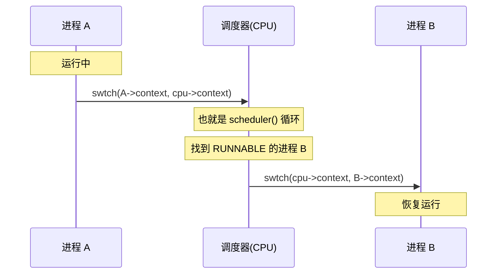
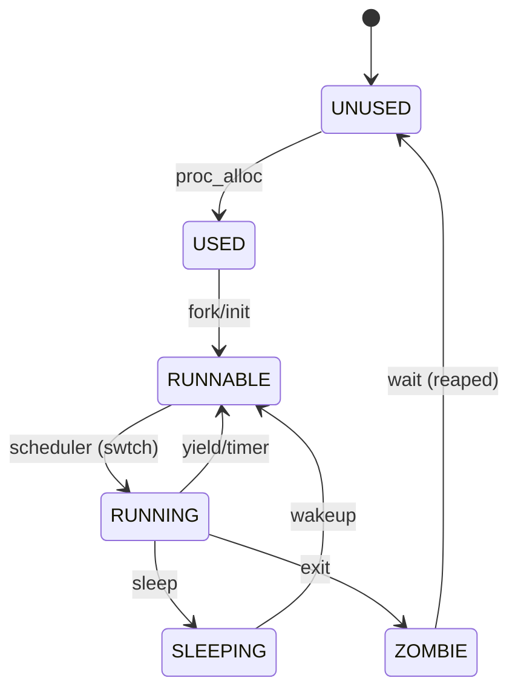

# LAB-6: 单进程走向多进程——进程调度与生命周期

## 过程日志
1. 2025.11.10 更新lab6文件
2. 2025.11.10 张子扬初步完成lab6的测试以及README
3. 2025.11.16 王俊翔修改test02/03/04涉及到的bug并完善README
4. 2025.11.24 张子扬设计新的测试样例


## 代码结构
```
OKOS
├── LICENSE        开源协议
├── .vscode        配置了可视化调试环境
├── registers.xml  配置了可视化调试环境
├── .gdbinit.tmp-riscv xv6自带的调试配置
├── common.mk      Makefile中一些工具链的定义
├── Makefile       编译运行整个项目
├── kernel.ld      定义了内核程序在链接时的布局
├── pictures       README使用的图片目录 (CHANGE, 日常更新)
├── lab-6-README.md实验指导书 (CHANGE, 日常更新)
├── README.md      实验报告
└── src            源码
    ├── kernel     内核源码
    │   ├── arch   RISC-V相关
    │   │   ├── method.h
    │   │   ├── mod.h
    │   │   └── type.h
    │   ├── boot   机器启动
    │   │   ├── entry.S
    │   │   └── start.c
    │   ├── lock   锁机制
    │   │   ├── spinlock.c
    │   │   ├── sleeplock.c (DONE, 实现睡眠锁)
    │   │   ├── method.h (CHANGE)
    │   │   ├── mod.h (CHANGE, 增加头文件)
    │   │   └── type.h (CHANGE)
    │   ├── lib    常用库
    │   │   ├── cpu.c
    │   │   ├── print.c
    │   │   ├── uart.c
    │   │   ├── utils.c
    │   │   ├── method.h
    │   │   ├── mod.h
    │   │   └── type.h
    │   ├── mem    内存模块
    │   │   ├── pmem.c
    │   │   ├── kvm.c (DONE, kvm_init从单进程内核栈初始化到多进程内核栈初始化)
    │   │   ├── uvm.c
    │   │   ├── mmap.c
    │   │   ├── method.h
    │   │   ├── mod.h
    │   │   └── type.h
    │   ├── trap   陷阱模块
    │   │   ├── plic.c
    │   │   ├── timer.c (DONE, 新增timer_wait函数, 增加时钟中断调度逻辑)
    │   │   ├── trap_kernel.c (DONE, 增加时钟中断调度逻辑)
    │   │   ├── trap_user.c (DONE, 增加时钟中断调度逻辑)
    │   │   ├── trap.S
    │   │   ├── trampoline.S
    │   │   ├── method.h (CHANGE, 增加timer_wait函数声明)
    │   │   ├── mod.h
    │   │   └── type.h
    │   ├── proc   进程模块
    │   │   ├── proc.c (DONE, 核心工作)
    │   │   ├── swtch.S
    │   │   ├── method.h (CHANGE)
    │   │   ├── mod.h
    │   │   └── type.h (CHANGE)
    │   ├── syscall 系统调用模块
    │   │   ├── syscall.c (CHANGE, 支持新的系统调用)
    │   │   ├── sysfunc.c (DONE, 实现新的系统调用)
    │   │   ├── method.h (CHANGE)
    │   │   ├── mod.h
    │   │   └── type.h (CHANGE)
    │   └── main.c (CHANGE)
    └── user       用户程序
        ├── initcode.c (CHANGE)
        ├── sys.h
        ├── syscall_arch.h
        └── syscall_num.h (CHANGE)
```

## 实验过程

### 1. 准备工作：从资源视角看进程
- **为什么先管资源？** 只有把 `proczero` 的“单例模式”拆成 `proc_list` 这种仓库，后面才能谈复制和调度。指导书虽然直接说“引入进程数组”，但我真正卡住的是“共享字段谁来加锁”。
- **做法**：先把 `proc_init/proc_alloc/proc_free` 写成一个闭环——`proc_alloc` 负责建立 PID、栈、trapframe，顺手把锁状态标好；`proc_make_first` 改成只是调用 `proc_alloc`，避免重复的手工初始化。与此同时，在 `kvm_init` 里把单栈映射展开成多栈，确保后面不会出现“不同进程踩同一页”的阴影。
- **验证**：test-01 继续保留，只要看到 `cpu 0/1 is booting!` 和 `proczero: hello world!`，就说明资源准备环节没被我新写的代码破坏。这个 baseline 在后面调 trap 和调度器时多次帮助我debug了。

### 2. 循环调度：原生进程是“搬运工”
- **思路来源**：指导书提醒我“原生进程 A 切到用户进程 B 需要两次 swtch”，于是把 `proc_sched` 理解成一个“搬运工”：负责保存当前 CPU 的上下文，再把控制权交给原生进程。
- **落地细节**：实现 `proc_scheduler` 时，我刻意把 `cpu->proc` 赋值和 `swtch` 放在一起，避免忘记更新 CPU 上下文。为了能肉眼追踪调度顺序，我加了 `proc %d is running...` 的调度日志，并通过一个宏开关控制噪声，这样 Test-02 调查时能直接看到调度轮转是否符合预期。



### 3. 时钟抢占：把“主动权”交还给系统
- **为什么需要它**：只靠循环扫描无法制约长进程，它们可能永远不调用 `proc_sched`。指导书强调“基于时钟的抢占式调度”，我把它理解成“让外部事件打断当前进程”。
- **实现思路**：我先补全 `proc_yield`，让它负责把 RUNNING 改回 RUNNABLE，再回到 `proc_sched`。随后在 `trap/timer.c` 写 `timer_wait/timer_update`，由 `trap_kernel.c` 调用；`trap_user.c` 里则保证在返回用户态前已经准备好时钟触发的上下文。
- **自检**：每次改动后我会观察调度日志是否出现“长时间只打印一个 pid”，借此判断时间片有没有真正生效。这一步直接支持了 Test-04 的“30 次 sleeping 日志”。

### 4. 生命周期：用状态机思路收敛 bug
- **fork 分支**：我把指导书“进程生命周期-1”抄成一张状态图，提醒自己 `proc_fork` 其实是“复制 + 绑定父子 + 设置返回值 + 修复内核栈”。这里最容易忘的是 `user_to_kern_sp`，如果不改，就会在 Test-02 里踩坑。
- **exit/wait 回收**：遵循“自己不能亲自办葬礼”的比喻，`proc_exit` 只负责把自己标成 ZOMBIE，并唤醒父进程；`proc_wait` 通过 `wait_lk` 保护共享字段，避免像 Test-03 那样死锁。我还在父进程退出时把孤儿挂给 `proczero`，防止资源泄漏。
- **sleep/wakeup**：指导书强调“RUNNABLE 仍然会被白白调度”，于是我给 `proc_sleep/proc_wakeup/proc_try_wakeup` 设计了“资源指针 + 锁”的接口，把“等什么”明确化。这个抽象一旦成立，`sys_sleep`、`timer_wait` 和 Test-04 里的父子 wait 都可以复用。
- **睡眠锁**：虽然 lab-6 不一定用得到，但我按照指南把 `kernel/lock/sleeplock.c` 补齐，等到文件系统实验就可以直接拿来挡长时间持锁的场景。



### 5. 用户态验证矩阵：把需求转成可视化输出来回归
- **选择测试的理由**：`initcode.c` 中三套程序分别覆盖“fork 树”“wait + mem”“sleep + wait”。我只要切换一个宏，就能让内核跑不同路径，特别适合频繁回归。
- **运行策略**：第一次改动后跑 `make clean && make run`，确认镜像和目标产物都干净；后续微调就用 `make run`。每次运行的串口输出都会截屏放到 `picture/`，并在 README 中引用，以便更换环境的人也能快速比对。
- **日志约定**：为了避免调试时陷入黑箱，我提前规定“调度/睡眠/父子等关键点必须有日志”，这让 Test-02~04 的问题从“猜测”变成“对照某个打印是否出现”。

### 6. 逐个测试收尾
虽然最终 `test.md` 会删除，但 README 仍保留了 test-01~04 的动机、现象和修复方式，方便助教直接复现，也记录了我在每个阶段踩到的坑。

#### Test-01：单进程基线自检
- 目标：确认 `proczero` 能在两核环境正常启动、打印 "hello world"，确保时钟/串口/基础 trap 流程无误，为后续多进程改造提供可回归的 baseline。
- 思路：保持 `initcode.c` 的 test-01 场景（仅执行 `proczero: hello world!`），重点观察 `cpu 0/1 is booting!` 与打印顺序，排查多核启动和基础中断初始化问题。
- 结果：串口输出稳定为 `cpu 0 is booting!`, `cpu 1 is booting!`, `proczero: hello world!`，说明调度骨架搭建前的内核最小闭环健全，可作为之后每次重构的 sanity check。


#### Test-02：多叉 fork 调度异常
- 现象：fork 树输出停在 `level-2!`，随后在 `proc_return` 附近触发 `Instruction page fault`。
- 解决思路：从“内核栈归属”这一抽象问题入手，确认子进程复制 trapframe 时沿用了父栈地址；因此在 `proc_fork()` 中把 `user_to_kern_sp` 改指向 `child->kstack + PGSIZE`，并在调度器里打印 `proc %d is running...` 方便核对调度序。
- 结果：`proc 1..4` 与 `level-1/2/3!` 交替出现，系统可以无限循环。


#### Test-03：wait/sleep 死锁与杂噪输出
- 现象：`mmap/brk` 日志后 panic `panic! acquire`，且终端被页表打印与调度日志淹没。
- 解决思路：从“父子同步协议”切入，发现 `proc_wait()` 持有 `parent->lk` 休眠，而 `proc_exit()` 唤醒时也要拿同一把锁，形成死锁；于是新增 `wait_lk`，让 `proc_sleep/proc_wakeup` 在这把专用锁上配合，同时清理 `sys_brk/sys_mmap/sys_munmap` 的噪声打印。
- 结果：`child proc → parent proc → good boy! → --------test end----------` 顺序稳定，终端干净。


#### Test-04：sleep 日志 & "kernel trap from user?"
- 现象：没有睡眠日志时难以判读；加上日志后又在多核环境频繁 panic，提示 `kernel trap from user? scause=0xa/0xc`。
- 解决思路：先在 `timer_wait()` 精准打印 30 条 `proc 2 is sleeping!`，再让 `proc_wait()` 输出两次 `proc 1 is wakeup!`，让用户可见日志与 README 对齐；随后审视“trap 返回顺序”，确认 `trap_user_return()` 没有在写 `stvec` 之前关闭中断，才导致中断抢占后 `SPP=0` 被误判为“来自用户”。修复方案是在函数开头 `intr_off()`，收尾由 `sret` 自动恢复。
- 结果：输出严格满足 README 要求，连续运行不再触发 panic。


#### 新增测试Test-05：多层fork树测试
测试内容：
- 根进程(PID=1): 创建两个子进程
- Child1: 创建一个孙子进程(Grandchild),然后等待孙子退出
- Child2: 直接退出
- Grandchild: 退出码10
- 根进程: 等待两个子进程退出,回收它们

测试目的：
- Fork正确性: 子进程能正确创建并获得新的PID
- 多层fork: 子进程可以再创建子进程(孙子进程)
- 父子关系: wait能正确等待自己的直接子进程
- 退出码传递: 子进程的退出码能正确传递给父进程
- 进程树结构: 3层进程树(根→子→孙)能正确工作


## 实验反思

1. **Baseline的重要性**：保留 Test-01 作为基线测试非常关键，能在多核 bring-up 和模块重构时快速验证最简单路径，排除基础设施噪音。
2. **深浅拷贝的陷阱**：在 `proc_fork` 复制 trapframe 时，必须注意指针成员（如 `user_to_kern_sp`）的深拷贝，避免父子进程共享内核栈指针导致踩踏。
3. **锁的粒度与死锁**：在 `wait/exit` 同步中，混用进程状态锁容易导致死锁。引入专用的 `wait_lk` 并遵循“睡眠时持有与唤醒方相同的锁”原则，有效解决了死锁问题。
4. **中断与竞态**：在 `trap_user_return` 等关键路径操作 CSR（如 `stvec`, `sstatus`）时，必须关闭中断以防止时钟中断插入导致的上下文混乱（如 `kernel trap from user` 错误）。
